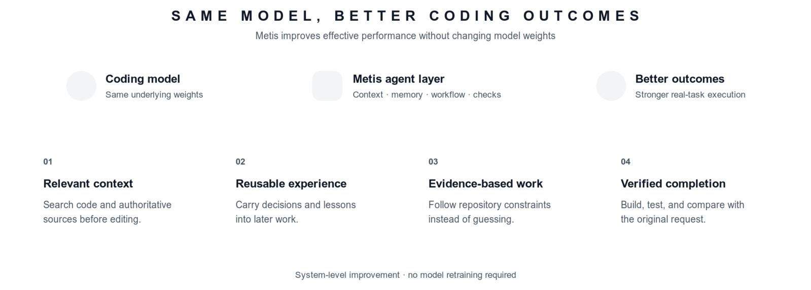

<p align="center">
  <picture>
    <source media="(prefers-color-scheme: dark)" srcset="src/modes/interactive/assets/metis-pixel-mark-white-on-black.png" />
    
  </picture>
</p>

<p align="center">
  <strong>English</strong> · <a href="README.zh-CN.md">简体中文</a>
</p>

<p align="center">
  <a href="https://www.typescriptlang.org/"></a>
  <a href="https://www.npmjs.com/package/@wholiver_hu/metis"></a>
  <a href="https://nodejs.org/"></a>
  <a href="#license"></a>
</p>

<p align="center">
  <strong>Help coding models write better code and finish faster with better context, reusable experience, and verified results.</strong>
</p>

<p align="center">
  <a href="#why-metis">Why Metis</a> ·
  <a href="#better-coding-performance">Coding performance</a> ·
  <a href="#what-makes-it-reliable">Reliability</a> ·
  <a href="#quick-start">Quick start</a>
</p>

---

## Quick start

Choose one interface. Both use the same Metis configuration, models, and sessions.

| Interface | Best for | Requirement |
| --- | --- | --- |
| **Desktop app** | Graphical workspace with CLI and server included | Apple silicon Mac (`arm64`) or Windows (`x64`) |
| **CLI** | Terminal, scripts, print/JSON, RPC, and SDK integrations | Node.js `>=22.19.0` and `npm` |

### Desktop app for macOS

1. [Download the latest Apple silicon `.dmg`](https://github.com/Wholiver/metis/releases/latest) (`Metis-*-macos-arm64.dmg`).
2. Open it and drag **Metis.app** into **Applications**.
3. Launch **Metis**. Node.js is already included.

### Desktop app for Windows

The Windows build bundles the full Metis CLI and server runtime. Choose the setup EXE for a normal installation or the ZIP for a portable copy.

> **Current build:** Windows `x64`. No separate Node.js installation is required.

1. Open the [latest GitHub Release](https://github.com/Wholiver/metis/releases/latest).
2. Download and run `Metis-*-win-x64-setup.exe`, or download `Metis-*-win-x64.zip`, extract it, and launch **Metis.exe** from the **Metis** folder.
3. Use the attached `.sha256` file to verify your download. If Windows SmartScreen warns about an unknown publisher, continue only when the file came from the official release page.

### CLI and terminal

Install Metis, then start an interactive session:

```bash
npm install -g --ignore-scripts @wholiver_hu/metis@latest
metis
```

Run `metis --help` to view every CLI option.

## Why Metis

Metis is an agent layer for coding models. It does not replace the model or change its weights. It improves the model's effective coding performance by giving it a better way to search, remember, work, and check its own result.

That means better repository understanding, fewer unsupported assumptions and missed requirements, stronger task completion, and less time spent repeating context.

### Better coding performance

<p align="center">
  <picture>
    <source media="(prefers-color-scheme: dark)" srcset="docs/images/metis-coding-performance.dark.png" />
    
  </picture>
</p>

For the same underlying model, Metis strengthens the system around it:

- **Relevant context** — search the repository and authoritative sources before editing.
- **Reusable experience** — carry useful decisions, lessons, and technical knowledge into later work.
- **Evidence-based implementation** — follow existing code, constraints, and project conventions instead of guessing.
- **Verified completion** — build, test, inspect output, and compare the result with the original request.

These mechanisms can improve practical coding outcomes without retraining or replacing the model. Results still depend on the model, task, tools, and environment.

### Faster completion

<p align="center">
  <picture>
    <source media="(prefers-color-scheme: dark)" srcset="docs/images/metis-speed.dark.png" />
    
  </picture>
</p>

In one user test with the same task:

- **Metis finished in 1 minute 30 seconds.**
- **OpenCode finished in 3 minutes 30 seconds.**
- No accuracy difference was observed in that test.

Metis used about 57% less time in this comparison. This is one user test, not a universal benchmark; results depend on the task, model, tools, and environment.

## What makes it reliable

<p align="center">
  <picture>
    <source media="(prefers-color-scheme: dark)" srcset="docs/images/metis-capabilities.dark.png" />
    
  </picture>
</p>

### Deterministic workflow runtime

Metis freezes a `StepSnapshot` before every model sample: model, reasoning level, Build/Plan mode, instruction stack, messages, visible tools, dispatcher, and context window. A tool call always executes against the snapshot that exposed it; a later step is the first point where a model, tool, extension, instruction, or mode change can take effect.

The local dispatcher runs explicitly safe read tools in parallel and serializes write or mixed tools. Steering is consumed only after current tool results persist; follow-ups wait until the turn is otherwise complete. This preserves assistant/tool-result pairing through retry, compaction, abort, and resume.

### Build and Plan

New CLI, TUI, and Desktop conversations start in Plan. Restored, switched, and forked sessions retain their saved mode; explicit Build selection wins. SDK callers keep its compatible default unless they pass `collaborationMode`. In Build, non-trivial work initializes `update_plan` before mutation, keeps one active step, and updates the checklist through verification. Build also emits concise ordinary progress text in the user's language around meaningful tool batches.

Plan is a read-only collaboration mode, not an OS sandbox. It hides and rejects write, mixed, shell, edit, and unclassified tools—including `update_plan`. It first grounds itself in repository evidence, uses `ask_user` only for material unresolved decisions, then returns a decision-complete `<proposed_plan>`. The latest proposal is a branch artifact: `read_plan` retrieves it after reload or context compaction. Switching back to Build restores the saved Build tool set. In Desktop, the latest proposal appears as a compact, expandable preview; **Process** switches to Build and immediately starts implementation and verification.

Use `/mode build` or `/mode plan` in CLI. Desktop exposes the same idle-only choice next to the model selector. Desktop replaces its composer with one `ask_user` question at a time, then restores the editor after submit or cancel. The TUI renders proposals without protocol tags, limits the preview to 12 source lines, and replaces the idle composer with terminal-native **Process** and **Submit changes** actions. Process first reads the durable proposal and current execution progress, then creates the Build checklist before any other tool. CLI, Desktop, JSON, RPC, Server, and SDK share the same mode, context-window, plan, and instruction-source state. Hosts with an interactive handler can answer `ask_user`; print/JSON and unattended SDK runs receive a recoverable unsupported result instead of hanging.

### Execution plans

Build persists a task-scoped execution checklist with one active step at most. Desktop and TUI show one live “Execution plan” surface above the composer and update it in place, so progress remains visible while tools run, after abort, after compaction, and after session reload. During Process, the surface first shows proposal-reading and checklist-creation states; runtime blocks every other tool until `read_plan` and then `update_plan` succeed. The surface intentionally shows only execution status and checklist items; the complete approved proposal remains available through its conversational preview and `read_plan`. Raw `update_plan` tool cards stay hidden to avoid duplicate UI. Completed state clears when a later independent Build prompt starts, while interrupted work remains resumable. `read_plan` returns both the latest proposal and current execution checklist.

### Memory

Metis automatically checkpoints active task state after prompts, complete steps, compaction, errors, aborts, and completion. It never requires model bookkeeping calls or adds a foreground model round trip.

The durable memory coordinator stores jobs, records, provenance, and a search index in `~/.metis/memories/state.sqlite`, with inspectable `MEMORY.md`, project views, and a summary index. It separates global preferences, project knowledge, and checkout-only facts. Metis exposes `search_memory` in Plan and Build so the model can search on demand, refine queries, and search again without a call-count limit; memory is no longer queried and injected automatically on every prompt. Results remain advisory evidence and cannot override current user, developer, or AGENTS instructions.

Background extraction can use only `search_memory`, with no Metis-specific output-token cap or search-round cap. Reasoning-capable models run extraction at `low`; models without reasoning support receive no reasoning parameter. Provider and model limits, aborts, timeouts, per-search result limits, and the six-candidate checkpoint limit still apply.

Use `/memory status|on|off|run|search|forget|reset`. `reset` requires explicit confirmation. `/memory status` and Desktop show why record count is zero, pending work, eligibility time, latest run counts, and fallback state. Proposal artifacts and long-term Memory are separate: no draft is automatically promoted to memory. Legacy Dream extensions, brain maps, and `.temp` memory logs are removed.

### Search before action

Metis investigates before making changes. It searches the repository first and uses web research when needed to check authoritative documentation, known solutions, release notes, or security information.

### Logs and verification

Metis records meaningful errors and completion summaries automatically. Before it says a task is finished, it compares the result with the user's original prompt and checks every requirement, constraint, and later clarification. It also runs relevant builds, tests, and functional checks when available.

Together, these behaviors help the same coding model work with better context, fewer assumptions, and a stronger completion loop.

## How it works

<p align="center">
  <picture>
    <source media="(prefers-color-scheme: dark)" srcset="docs/images/metis-workflow.dark.png" />
    
  </picture>
</p>

1. **Freeze context** — assemble trusted base/developer instructions, untrusted runtime context, and the real user request; the model retrieves durable memory explicitly when useful.
2. **Investigate or build** — Plan reads and proposes; Build changes only what evidence supports.
3. **Persist and recover** — retain message/tool pairs, workflow checkpoints, structured plan state, and compaction summaries.
4. **Verify and deliver** — run risk-proportionate checks, report evidence, and name remaining risk.

<details>
<summary><strong>Developer information</strong></summary>

### Interfaces

Metis supports an interactive terminal, print and JSON output, RPC integration, and an SDK for Node.js applications.

The package exports the SDK from `@wholiver_hu/metis` and the RPC entry point from `@wholiver_hu/metis/rpc-entry`.

### Commands

| Command | Purpose |
| --- | --- |
| `npm run build` | Compile TypeScript and copy runtime assets. |
| `npm test` | Run the Vitest test suite. |
| `npm run clean` | Remove compiled output. |
| `npm run build:binary` | Build the standalone binary. |

</details>

## Contributing

Contributions are welcome. See [CONTRIBUTING.md](CONTRIBUTING.md) for core development, Extension integration, Package distribution, testing, and AI-assisted contribution guidance.

## License

Distributed under the [MIT License](https://opensource.org/license/mit).
