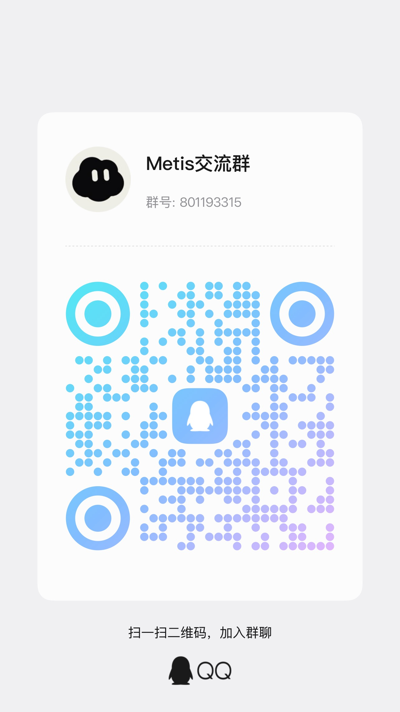

<p align="center">
  
</p>

<p align="center">
  <a href="README.md">English</a> · <strong>简体中文</strong>
</p>

<p align="center">
  <a href="https://www.typescriptlang.org/"></a>
  <a href="https://www.npmjs.com/package/@wholiver_hu/metis"></a>
  <a href="https://github.com/Wholiver/metis/releases/latest"></a>
  <a href="https://nodejs.org/"></a>
  <a href="#许可证"></a>
  <a href="https://siliconflow.cn"></a>
</p>

<p align="center">
  <strong>具备硬核验证门禁、越用越懂你的全自适应原生编程 Agent。</strong><br />
  <em>从终端 TUI 到 React 桌面端，以五角色递归团队与真实验证证据终结 AI 幻觉式“已完成”。</em>
</p>

<p align="center">
  <a href="#为什么选择-metis">核心差异</a> ·
  <a href="#快速开始">快速开始</a> ·
  <a href="#四大杀手锏能力">杀手锏特性</a> ·
  <a href="#交流与社区">交流与社区</a> ·
  <a href="#合作伙伴">合作伙伴</a> ·
  <a href="#文档">文档</a>
</p>

## 为什么选择 Metis？

市面上的大多数 Coding Agent 仍然停留在“**单线程对话 + 盲目写代码 + 口头宣告搞定**”的初级阶段。Metis 为解决实际工程中最痛苦的断点而生：

```text
传统 Agent:  提问 ──> 盲写代码 ──> 遇到报错瞎猜 ──> 未跑测试就宣称“已修复” ──> 下次对话全部遗忘
Metis:      只读规划 ──> 5角色递归委派(隔离Worktree) ──> G0-G7硬证据门禁拦截假完成 ──> 跨会话自我进化
```

1. **拒绝“假装完成”（No False Completion）**：内置 G0~G7 自动化验证收据门禁与视频/测试日志证据链，跑不通测试绝对禁止下班。
2. **越用越聪明的自我学习闭环**：无需手动写提示词注入，Metis 在后台自主提炼你的编码偏好、项目踩坑经验与可复用 Skill，透明可回滚。
3. **真正的工程级多智能体团队**：`coordinator`、`planner`、`implementer`、`reviewer`、`verifier` 五大具名角色，支持独立 Git Worktree 隔离并发执行。
4. **双形态统一生产力**：轻量沉浸的终端 TUI 与全功能 React/Vite 桌面端（内置独立运行时，免配置 Node.js 随开随用）。

## 快速开始

### 桌面版

内置独立运行时与 Metis CLI / Server，无需另行安装 Node.js：

- **macOS（Apple 芯片）**：从[最新 GitHub Release](https://github.com/Wholiver/metis/releases/latest) 下载 `Metis-*-macos-arm64.dmg`，将 **Metis.app** 拖入**应用程序**。
- **Windows（x64）**：从[最新 GitHub Release](https://github.com/Wholiver/metis/releases/latest) 下载 `Metis-*-win-x64-setup.exe` 安装包或 `.zip` 解压使用。

<details>
<summary><strong>CLI 安装（Node.js &gt;= 22.19.0）</strong></summary>

```bash
npm install -g @wholiver_hu/metis
metis
```

在任意项目目录中直接运行：

```bash
metis "解释这个代码仓库"
metis @src/main.ts "检查这个文件"
git diff | metis -p "审查这个 diff"
```

支持的订阅 Provider 可通过 `/login` 登录，也可配置 API Key。完整使用指南见[快速入门](docs/quickstart.md)。

</details>

## 四大杀手锏能力

### 1. 🛡️ G0~G7 硬核验证门禁（Evidence-Backed Verification）
- **根治 AI 幻觉与早退**：Metis 将任务拆解为严格的状态机推进（Frontier）。每一步都绑定对应的治理凭证收据（Receipt）。
- **硬性拦截 `FALSE_COMPLETION_BLOCKED`**：即使模型在输出中声称“我已全部修好”，只要缺少测试退出码为 0 的运行日志或真实 UI 验证证据，系统核心机制将直接拦截并强制退回复查或修复流程。
- **全多模态检查**：不仅支持命令行与测试套件，还内置 ffmpeg/ffprobe 视频证据解析器与截图对比工具，对前端动效与交互进行可复核的像素级检查。

### 2. 🧠 自主自我学习闭环（Autonomous Self-Learning）
- **零 Token 隐式学习**：不需要用户反复教导，Metis 在每轮任务复盘与空闲时段，自动捕捉代码 Diff 偏好、项目特有架构规范与高频排错经验。
- **项目与用户双画像**：持久化于本地文件系统（`~/.metis/agent/adaptations/`），自主提炼专属 Skill 并对陈旧规则自动衰减。
- **透明审查与一键回滚**：所有自适应学习均记录在修订日志中，支持在桌面端设置面板中一键查看学到的规则并随时回滚版本。

### 3. 👥 原生 5 具名角色递归团队（Recursive Multi-Agent System）
- **分工明确的专业团队**：由 `coordinator` 统筹全局、`planner` 架构推导、`implementer` 编写代码、`reviewer` 交叉代码审查、`verifier` 执行真实测试与门禁核验。
- **Git Worktree 物理隔离**：子 Agent 在独立的 Git 临时分支/工作区中并行推演，互不冲突，避免多处改动污染工作树。
- **L0→L4 递归委派控制**：精准限制派生深度与 Token 消耗，防止无序递归膨胀，同时在最终聚合完整的推理链路与耗时成本树。

### 4. ⚡ Plan ↔ Build 双模与全生态自由
- **只读 Plan 模式**：严禁任何文件修改，专供深度代码走读、架构梳理与技术方案产出，零破坏风险。
- **动态 Build 模式**：按照已审阅的 Roadmap 动态推进任务清单，实时感知进度与剩余工单。
- **不被任何厂商锁定**：原生支持 OpenAI、Anthropic、DeepSeek、Gemini、Groq、Ollama、vLLM 以及 OrcaRouter，同时完整支持 TypeScript 插件扩展、Agent Skills 标准与 MCP 协议。

<details>
<summary><strong>基准评测实测数据与主流 Agent 矩阵对比</strong></summary>

### Terminal-Bench 2.1 实测对比

在相同模型（**DeepSeek V4 Flash**）、相同 89 个真实编程任务、相同成本预算与执行环境下进行严格对比测试：

| Agent 框架 | 评测模型 | 评测基准 | 解决率 (准确率) | 架构与 Harness 核心优势 |
| :--- | :--- | :--- | :---: | :--- |
| 🏆 **Metis** | DeepSeek V4 Flash | Terminal-Bench 2.1 (89 任务) | **73 / 89 (82.02%)** | ✅ 递归 5 角色多智能体 + 自我学习适配 + Plan/Build 分离 |
| **OpenCode** | DeepSeek V4 Flash | Terminal-Bench 2.1 (89 任务) | 60 / 89 (67.42%) | ⚠️ 单线程扁平工具执行流 |
| 📈 *提升幅度* | *同等模型与预算* | *完全一致的执行环境* | **+14.6% (+13 项任务)** | 🚀 *纯 Agent Harness、适配演进与验证门禁带来的性能跃升* |

### 全维度特性对比矩阵

| 核心能力 | Metis | Claude Code | OpenCode | Cursor / Cline |
| :--- | :---: | :---: | :---: | :---: |
| **开源许可与费用** | ✅ **MIT ($0 免费)** | ❌ 闭源商业 | ✅ MIT ($0 免费) | ⚠️ 商业增值 |
| **模型生态自由度** | ✅ **任意模型 / OrcaRouter** | ❌ 仅限 Anthropic | ✅ 多 Provider | ⚠️ 受限 / BYOK |
| **客户端界面** | ✅ **终端 TUI + React 桌面端** | ⚠️ 仅终端 | ⚠️ 仅终端 | ⚠️ 仅 IDE 插件 |
| **工作流控制** | ✅ **Plan 规划 ↔ Build 构建** | ⚠️ 单一线性流 | ⚠️ 单一线性流 | ⚠️ 对话/行内 |
| **多智能体架构** | ✅ **递归 L0→L4 (5 具名角色)** | ⚠️ 扁平子 Agent | ⚠️ 基础支持 | ❌ 无 |
| **自我学习适配** | ✅ **文件系统画像与工作流演化** | ❌ 临时上下文 | ❌ 临时上下文 | ⚠️ 代码 Embeddings |
| **验证与证据门禁** | ✅ **测试门禁 + 视频证据** | ⚠️ 手工 Bash | ⚠️ 手工 Bash | ⚠️ 基础 Linter |
| **无头基准评测** | ✅ **Python 适配器 + 全链路 Trace** | ❌ 无原生适配 | ⚠️ 部分支持 | ❌ 无 |

</details>

## 合作伙伴

| 商标 | 合作方 | 链接 |
| :---: | :--- | :--- |
|  | **硅基流动（SiliconFlow）** — 国内领先的独立生态词元（Token）供应平台，为Metis提供高效、灵活的模型推理能力。 | [siliconflow.cn](https://siliconflow.cn) |

## 文档

| 主题 | 指南 |
| --- | --- |
| 安装、认证与首次运行 | [快速入门](docs/quickstart.md) |
| 命令与终端界面 | [使用 Metis](docs/usage.md) · [TUI](docs/tui.md) |
| 自主自我学习与运行时自适应 | [自主自我学习闭环](docs/self-learning.md) |
| 具名多智能体体系 | [多智能体与递归委派](docs/agents.md) |
| 基准评测与无头模式 | [TerminalBench 与 Harbor 适配](docs/terminalbench.md) |
| Provider 与自定义模型 | [Providers](docs/providers.md) · [在 Metis 中使用 SiliconFlow](docs/use-siliconcloud-in-metis.md) · [Custom models](docs/models.md) · [Custom providers](docs/custom-provider.md) |
| 会话与上下文压缩 | [Sessions](docs/sessions.md) · [Compaction](docs/compaction.md) |
| Extensions、Skills 与 Packages | [Extensions](docs/extensions.md) · [Skills](docs/skills.md) · [Packages](docs/packages.md) |
| Prompt 与界面定制 | [Prompt templates](docs/prompt-templates.md) · [Themes](docs/themes.md) · [Keybindings](docs/keybindings.md) |
| 程序化集成 | [SDK](docs/sdk.md) · [RPC](docs/rpc.md) · [JSON](docs/json.md) |
| 视频检查 | [Video tool](docs/video.md) |
| 安全与配置 | [Security](docs/security.md) · [Settings](docs/settings.md) |
| 平台与隔离 | [Windows](docs/windows.md) · [Termux](docs/termux.md) · [tmux](docs/tmux.md) · [Containers](docs/containerization.md) |

全部指南见[文档索引](docs/index.md)。

<details>
<summary><strong>开发者信息</strong></summary>

```bash
npm run build                 # 编译 TypeScript 并复制运行时资源
npm test                      # 运行 Vitest 测试套件
npm run clean                 # 删除编译输出
npm run build:binary          # 构建独立二进制文件
npm --prefix desktop run dev  # 启动 React/Vite Desktop 开发环境
npm --prefix desktop run build # 构建 Renderer 与 Electron Artifact
```

软件包从 `@wholiver_hu/metis` 导出 Node.js SDK，并从 `@wholiver_hu/metis/rpc-entry` 导出 RPC 入口。

</details>

## 交流与社区

欢迎加入 Metis 开发者与用户交流群！无论是日常使用踩坑、Bug 反馈、新特性想法交流，还是探讨多智能体前沿实践，都欢迎一起探讨：

<p align="center">
  <br />
  <strong>Metis 交流群（QQ）：801193315</strong>
</p>

- 🐛 **Bug 提交与功能建议**：欢迎在 [GitHub Issues](https://github.com/Wholiver/metis/issues) 提交反馈与追踪进度。
- 💡 **方案与话题讨论**：欢迎参与 [GitHub Discussions](https://github.com/Wholiver/metis/discussions) 共同交流。

## 参与贡献

欢迎参与 Metis 开发。开发流程、Extension 与 Package 接入、测试及 AI 辅助贡献说明见 [CONTRIBUTING.zh-CN.md](CONTRIBUTING.zh-CN.md)。

## 致谢与上游

Metis 基于并启发自 Mario Zechner 的 [pi](https://github.com/earendil-works/pi)。

## 许可证

本项目使用 [MIT License](LICENSE)。

本项目认可 [LINUX DO](https://linux.do) 社区。
