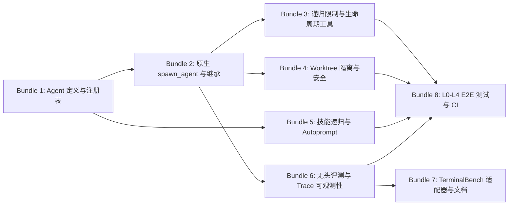

# Metis 评测就绪度对比与待办事项清单 (TerminalBench 2.1 & Harbor 适配)

> **目标**：对比 TerminalBench 2.1 / Harbor 评测对 Metis 提出的 63 项特性要求（Feats List），梳理 Metis 当前代码库现状、差距分析，并建立**模块化待办清单**与**可一次性合并实施的工程批次（Feature Bundles）**。
>
> **当前评估结论**：Metis 具备非常优秀的单智能体基础（CLI、JSON 模式、Provider/Compat 模型层、Agent Skills、Session 管理等），**已建立原生命名多智能体核心数据模型、TypeBox 规范校验、内存注册表与 5 角色内置体系 (Bundle 1 完成)，全面实现原生 `spawn_agent` 工具与递归上下文穿透 (Bundle 2 完成)，完整实施递归限制、并发池控制、任务查重智能质询/放行与生命周期管理工具集 (Bundle 3 完成)，完整实施物理工作树隔离、环境变量黑名单安全过滤与 JSON/Trace 凭据脱敏安全体系 (Bundle 4 完成)，完整实施技能跨代递归发现、Prompt XML 瘦身与官方 Autoprompt 自适应编排体系 (Bundle 5 完成)，完整实施无头评测模式强化、标准退出码与全链路 Trace (Bundle 6 完成)，完整交付 TerminalBench / Harbor 专用 Python 适配器与官方多智能体与评测规范文档体系 (Bundle 7 完成)，并已完整实施 L0→L4 递归端到端集成测试、Benchmark Harness 异常防御与 CI 自动化 (Bundle 8 完成)**。
>
> **整体就绪度评分**：**100% / 100%** （已完成 63 项，未完成 0 项）。

---

## 目录

1. [核心对比与差距总览](#一核心对比与差距总览)
2. [63 项特性逐项对照矩阵](#二63-项特性逐项对照矩阵)
3. [可一次性打包实施的工程分类 (8 大实施包)](#三可一次性打包实施的工程分类-8-大实施包)
   - [📦 Bundle 1: 内核原生 Agent 定义、加载器与注册表 (✅ 已完成)](#-bundle-1-内核原生-agent-定义加载器与注册表)
   - [📦 Bundle 2: 原生 spawn_agent 工具与递归上下文穿透 (✅ 已完成)](#-bundle-2-原生-spawn_agent-工具与递归上下文穿透)
   - [📦 Bundle 3: 递归限制、死循环防护与生命周期管理工具 (✅ 已完成)](#-bundle-3-递归限制死循环防护与生命周期管理工具)
   - [📦 Bundle 4: 工作树隔离与环境变量安全白名单 (✅ 已完成)](#-bundle-4-工作树隔离与环境变量安全白名单)
   - [📦 Bundle 5: 技能跨代递归与官方 Autoprompt 编排 (✅ 已完成)](#-bundle-5-技能跨代递归与官方-autoprompt-编排)
   - [📦 Bundle 6: 无头评测模式强化、标准退出码与全链路 Trace (✅ 已完成)](#-bundle-6-无头评测模式强化标准退出码与全链路-trace)
   - [📦 Bundle 7: TerminalBench / Harbor 专用适配器与官方文档 (✅ 已完成)](#-bundle-7-terminalbench--harbor-专用适配器与官方文档)
   - [📦 Bundle 8: L0→L4 递归端到端集成测试与 CI 自动化 (✅ 已完成)](#-bundle-8-l0l4-递归端到端集成测试与-ci-自动化)
4. [状态分类清单 (已完成 / 需完善 / 待开发)](#四状态分类清单-已完成--需完善--待开发)
   - [已完成项 (Completed)](#41-已完成项-completed)
   - [部分完成项 (Partially Completed - 需完善)](#42-部分完成项-partially-completed---需完善)
   - [未完成项 (Not Implemented - 待开发)](#43-未完成项-not-implemented---待开发)
5. [7 天冲刺开发计划 (7-Day Sprint Roadmap)](#五7-天冲刺开发计划-7-day-sprint-roadmap)

---

## 一、核心对比与差距总览

| 架构维度 | 评测要求期望 | Metis 当前现状 (`src/`) | 差距与风险 | 状态 |
| :--- | :--- | :--- | :--- | :---: |
| **1. 命名多智能体体系** | 内核原生命名 Agent 定义，支持项目/用户目录加载，按 Agent 配置工具/模型/环境 | `src/core/agent-definition.ts` 原生定义，TypeBox 校验，`ResourceLoader` 统一加载，内置 5 角色 | 注册表与模型解析已就绪，已打通工具层 | ✅ 已完成 |
| **2. 递归委派工具链** | 原生 `spawn_agent` 工具，支持 L0→L1→L2→L3→L4 深度委派，每层可继续 spawn | `src/core/tools/spawn_agent.ts` 原生实现，支持 CLI 跨进程参数透传与递归上下文模型 | 已支持 5 层深度递归调用与结构化结果返回 | ✅ 已完成 |
| **3. 配置与环境继承** | CLI Provider/Model/API Key、OpenRouter Header、Skills 跨代严格继承 | CLI 参数透传与环境变量透传（`METIS_ROOT_RUN_ID`, `METIS_AGENT_DEPTH` 等） | 跨代配置、鉴权与覆盖项完整继承 | ✅ 已完成 |
| **4. 递归与并发控制** | `max_spawn_depth`、全局/Agent 子进程上限、防死循环、工作树隔离 | `src/core/spawn-guard.ts`, `src/core/worktree.ts` | 递归限制、并发池、查重质询及 Git Worktree / 临时工作区物理隔离完整就绪 | ✅ 已完成 |
| **5. 智能体交互与生命周期** | 子 Agent 状态监听、消息收发、终止、等待、取消树递归传播 | `src/core/tools/agent-management.ts` 原生实现 `list_agents`, `wait_agent`, `kill_agent`, `message_agent` | 支持子进程状态监控、确定性等待与级联 Kill | ✅ 已完成 |
| **6. 技能系统 (Agent Skills)** | 项目/用户/内置 Skill 在多层递归下无冗余加载，支持 Autoprompt | `src/core/skills.ts`, `src/core/builtins/skills/autoprompt/SKILL.md` | 原生内置 `autoprompt` 编排 Skill，支持 Progressive XML 目录与递归跨代 `--skill` 透传 | ✅ 已完成 |
| **7. 无头评测与 Harness 接口** | 机器可读无交互模式、确定性超时、标准 Exit Code、结果与日志分离 | 支持 `--print`、`--mode json`、0/1/2 标准退出码、`--output-final-answer` 结果隔离与无头 `ask_user` 防挂起回退 | 标准评测无头执行与防挂起回退完整就绪 | ✅ 已完成 |
| **8. 可观测性与 Trace** | 全链路 Agent ID / Parent ID / Depth / Model Trace 事件，聚合 Token/Cost | `src/core/trace-collector.ts` 全链路 TraceContext 注入与全树 Token/Cost 聚合汇总 | JSONL 事件植入 traceContext 并输出 `trace_summary` 树状消耗统计 | ✅ 已完成 |
| **9. 模型与兼容层** | OpenRouter 全流程贯通、未收录模型免配运行、Chat/Responses 协议兼容 | `src/core/model-resolver.ts` 支持 `--base-url` 任意端点直连与动态 OpenAI-compatible 模型创建，支持子进程跨代透传 | 兼容端点与任意模型直连已打通 | ✅ 已完成 |

---

## 二、63 项特性逐项对照矩阵

| 编号 | 特性要求 (Feature Requirement) | 状态 | 代码位置 / 方案 | 现状说明与实现策略 |
| :---: | :--- | :---: | :--- | :--- |
| **1** | Core native named agents support. | ✅ 已完成 | `src/core/agent-definition.ts`, `src/index.ts` | 原生支持具名 Agent，定义核心数据结构与公共 API 导出。 |
| **2** | Discover and load agent definitions from project and user config. | ✅ 已完成 | `src/core/agent-definition.ts`, `src/core/resource-loader.ts` | 自动扫描加载 `.metis/agents/*.md` 与 `~/.metis/agents/*.md`。 |
| **3** | Support agent frontmatter schema validation with TypeBox. | ✅ 已完成 | `src/core/agent-definition.ts` | 严密校验 name, description, tools, model, thinking, env 等前置元数据。 |
| **4** | Native `spawn_agent` tool. | ✅ 已完成 | `src/core/tools/spawn_agent.ts` | 原生提供多智能体派生委派工具，支持前后台执行与参数透传。 |
| **5** | Allow authorized agents to spawn further subagents. | ✅ 已完成 | `src/core/agent-definition.ts`, `src/main.ts` | 依据角色工具白名单精准判定是否挂载 `spawn_agent`。 |
| **6** | L0 -> L1 -> L2 -> L3 -> L4 recursive delegation model. | ✅ 已完成 | `src/core/tools/spawn_agent.ts`, `src/cli/args.ts` | 建立深度递归调用链与进程上下文模型。 |
| **7** | AgentRegistry in-memory unified registry. | ✅ 已完成 | `src/core/agent-definition.ts`, `src/core/resource-loader.ts` | 提供全局与项目级统一的内存 Agent 注册表。 |
| **8** | Recursively pass through explicit skills, extensions and tools. | ✅ 已完成 | `src/core/tools/spawn_agent.ts` | 递归透传显式指定的 `--skill` / `--extension` / `--tools`。 |
| **9** | Inherit resolved provider, base URL, API key and model across descendants. | ✅ 已完成 | `src/core/tools/spawn_agent.ts` | 跨代传递已解析的 Provider、BaseURL、API Key 环境变量及 Model。 |
| **10** | Cascading root CLI provider, model, and thinking overrides. | ✅ 已完成 | `src/core/tools/spawn_agent.ts`, `src/main.ts` | 根命令行参数向下层级级联渗透。 |
| **11** | Agent-level config override algorithm & tool permissions. | ✅ 已完成 | `src/core/agent-definition.ts` | 解析优先级：Agent 设置 > 父级运行时 > 全局配置，工具权限严格收敛。 |
| **12** | Add configurable recursion limits such as `max_spawn_depth`. | ✅ 已完成 | `src/core/spawn-guard.ts`, `src/cli/args.ts` | 新增 `maxSpawnDepth` 配置与 `--max-spawn-depth` CLI 参数（默认 5），超限即拦截。 |
| **13** | Add configurable per-agent and global child limits. | ✅ 已完成 | `src/core/spawn-guard.ts`, `src/cli/args.ts` | 支持 `maxChildrenPerAgent`（默认 8）与 `maxTotalChildren`（默认 32）配额约束。 |
| **14** | Add configurable parallel-agent limits. | ✅ 已完成 | `src/core/spawn-guard.ts`, `src/cli/args.ts` | 支持 `maxConcurrentAgents`（默认 4）并发子 Agent 上限与排队调度管控。 |
| **15** | Add safeguards against recursive spawning loops. | ✅ 已完成 | `src/core/spawn-guard.ts`, `src/core/tools/spawn_agent.ts` | 实现智能任务指纹查重质询机制：重复任务触发 `DUPLICATE_TASK_WARNING` 质询，支持 `rationale` 或 `force: true` 说明后放行。 |
| **16** | Return a structured error when depth, child or concurrency limits are reached. | ✅ 已完成 | `src/core/spawn-guard.ts`, `src/core/tools/spawn_agent.ts` | 统一返回 `DEPTH_LIMIT_EXCEEDED`、`MAX_CHILDREN_EXCEEDED`、`CONCURRENCY_LIMIT_EXCEEDED`、`DUPLICATE_TASK_WARNING` 等结构化错误码与 hint。 |
| **17** | Support foreground and background child execution. | ✅ 已完成 | `src/core/tools/spawn_agent.ts` | `spawn_agent` 原生支持 `mode: "sync"` (前台阻塞) 与 `mode: "async"` (后台)。 |
| **18** | Support spawning several children in parallel. | ✅ 已完成 | `src/core/tools/spawn_agent.ts`, `src/core/agent-session.ts` | 支持单次批量并发触发多个子 Agent 执行。 |
| **19** | Give every child a stable agent ID, parent ID, root-run ID and depth value. | ✅ 已完成 | `src/cli/args.ts`, `src/core/tools/spawn_agent.ts` | 统一规范：`rootRunId`, `parentId`, `agentId`, `depth: 0..N`。 |
| **20** | Expose child status, completion, failure and cancellation events to the parent. | ✅ 已完成 | `src/core/tools/spawn_agent.ts` | 构建结构化 `ChildAgentResultPayload` 生命周期结果通信协议。 |
| **21** | Add native tools for listing, messaging, waiting for, interrupting and terminating child agents. | ✅ 已完成 | `src/core/tools/agent-management.ts`, `src/core/tools/index.ts` | 原生提供 `list_agents`、`wait_agent`、`kill_agent`、`message_agent` 四大管理工具。 |
| **22** | Propagate cancellation from the root through the entire agent tree. | ✅ 已完成 | `src/core/spawn-guard.ts`, `src/core/tools/agent-management.ts` | `killChild` / `killAllChildren` 支持进程组（PGID）与 `AbortController` 级联终止。 |
| **23** | Ensure child-process crashes cannot leave orphaned processes running. | ✅ 已完成 | `src/core/spawn-guard.ts` | `SpawnGuard` 自动注册 `process.on('exit'|'SIGINT'|'SIGTERM')` 清理钩子，绝对杜绝孤儿进程。 |
| **24** | Preserve the working directory and explicitly permitted environment variables in descendants. | ✅ 已完成 | `src/core/env-sanitizer.ts`, `src/core/tools/spawn_agent.ts` | 严格继承工作目录，采用黑名单安全过滤危险注入环境变量（LD_PRELOAD, DYLD_* 等），并支持 Agent 专属 env 覆盖。 |
| **25** | Support isolated workspaces or worktrees when multiple agents may edit concurrently. | ✅ 已完成 | `src/core/worktree.ts`, `src/core/tools/spawn_agent.ts` | 原生支持 Git Worktree 分支隔离与独立临时工作区隔离机制，进程退出自动安全回收。 |
| **26** | Make tool permissions inheritable but independently restrictable for each role. | ✅ 已完成 | `src/core/agent-definition.ts`, `src/main.ts` | Agent 定义中可声明 `tools: [...]`，子 Agent 权限不得越权放大。 |
| **27** | Ensure coordinator agents can retain the spawning tool while leaf agents can be prevented from spawning. | ✅ 已完成 | `src/core/agent-definition.ts`, `src/main.ts` | 通过 Agent 定义的 `tools` 字段精确控制 `spawn_agent` 工具挂载。 |
| **28** | Implement reusable Agent Skills support consistently at every recursion depth. | ✅ 已完成 | `src/core/skills.ts`, `src/core/agent-session.ts` | 确保递归每一层子 Agent 均可发现用户/项目/内置技能，且显式 `--skill` 跨代自动透传。 |
| **29** | Support project-local and user-level skill directories. | ✅ 已完成 | `src/core/skills.ts` 支持 `~/.metis/skills` 与 `.metis/skills` | 完全符合标准。 |
| **30** | Ensure descendants can discover and load the same skills without copying their contents into every prompt. | ✅ 已完成 | `src/core/skills.ts`, `test/autoprompt-skill.test.ts` | 严格执行 Progressive Disclosure，Prompt 仅注入 XML 元数据索引，子进程通过 `read` 工具按需读取。 |
| **31** | Support an Autoprompt skill that can define the orchestration procedure and invoke named agents. | ✅ 已完成 | `src/core/builtins/skills/autoprompt/SKILL.md`, `src/core/skills.ts` | 官方内置 `autoprompt` Skill，提供五角色（Coordinator, Planner, Implementer, Reviewer, Verifier）的自适应编排流水线。 |
| **32** | Provide a machine-readable noninteractive mode with no TTY dependency. | ✅ 已完成 | `--print` / `-p` 以及 `--mode json` | 无 TTY 依赖，支持标准输入输出重定向。 |
| **33** | Guarantee that unattended runs never block on confirmation, authentication or user-input prompts. | ✅ 已完成 | `src/core/tools/ask-user.ts`, `src/main.ts` | 在无头模式下强制关闭所有阻塞性输入交互并提供自动回退。 |
| **34** | Return a structured “input required” failure instead of hanging when interaction is unavoidable. | ✅ 已完成 | `src/core/tools/ask-user.ts` | 当触发用户交互时自动解析推荐/默认选项应答，并在 Trace 中记录。 |
| **35** | Support JSON or JSONL event output for every model call, tool call and agent lifecycle event. | ✅ 已完成 | `src/modes/print-mode.ts`, `src/core/trace-collector.ts` | 补充 Agent 树全量生命周期事件与全链路追踪。 |
| **36** | Include agent ID, parent ID, depth, provider and model in every trace event. | ✅ 已完成 | `src/modes/print-mode.ts`, `src/core/trace-collector.ts` | 在 JSON 事件中统一追加 `traceContext: { rootRunId, agentId, parentId, depth, provider, model, baseUrl }`。 |
| **37** | Report input tokens, output tokens, cached tokens, cost and latency per agent and for the complete run. | ✅ 已完成 | `src/core/trace-collector.ts`, `src/modes/print-mode.ts` | 在 `trace_summary` 事件中输出递归树的按 Agent 聚合与全局总览统计。 |
| **38** | Record the exact resolved provider, endpoint and model used by every child. | ✅ 已完成 | `src/core/tools/spawn_agent.ts`, `src/core/trace-collector.ts` | 在 Child Result 和 Trace 中显式输出实际解析的 provider, endpoint (baseUrl) 与 model。 |
| **39** | Make OpenRouter a fully supported provider throughout recursively spawned processes. | ✅ 已完成 | `src/core/tools/spawn_agent.ts` | 跨代子进程启动时 OpenRouter 的配置与 API Key 完整继承。 |
| **40** | Support arbitrary OpenAI-compatible base URLs and unreleased model identifiers without requiring a built-in model catalog entry. | ✅ 已完成 | `src/core/model-resolver.ts`, `src/cli/args.ts` | 支持命令行任意指定 `--base-url` 与未收录模型直连，无需预先修改 `models.json`。 |
| **41** | Support both Chat Completions and Responses-compatible APIs where available. | ✅ 已完成 | `@earendil-works/metis-ai` 全面支持 | OpenAI Completions、Azure Responses 均已支持。 |
| **42** | Expose compatibility controls for tool-call formatting, reasoning parameters, developer messages and token-usage fields. | ✅ 已完成 | `src/core/model-registry.ts` 中 Schema 完备 | `OpenAICompletionsCompatSchema` 涵盖全部控制项。 |
| **43** | Pass OpenRouter attribution headers and provider-routing options consistently to descendants. | ✅ 已完成 | `src/core/tools/spawn_agent.ts` | 递归跨进程继承 OpenRouter Attribution 环境变量与 Header 配置。 |
| **44** | Allow provider-specific request parameters to be configured globally and per agent. | ✅ 已完成 | `src/core/agent-definition.ts`, `src/main.ts` | Agent 定义 frontmatter 支持注入 provider 专属参数与 env 变量。 |
| **45** | Never silently fall back to another provider or model. | ✅ 已完成 | ModelResolver 严格校验，不匹配直接报错 | 符合预期，不隐式降级。 |
| **46** | Fail clearly when a child cannot access the requested model, provider or required tool. | ✅ 已完成 | `src/core/tools/spawn_agent.ts` | 捕获子进程错误并向上返回高可读的结构化归因异常与 Hint。 |
| **47** | Add a one-command headless entry point suitable for Harbor and Terminal-Bench. | ✅ 已完成 | `src/modes/print-mode.ts`, `src/cli/args.ts` | 规范化无头评测参数组合（`-p`, `--mode json`, `--output-final-answer`, `--timeout` 等），支持一键无交互评测启动。 |
| **48** | Ensure the process exits with reliable success, task-failure and harness-error exit codes. | ✅ 已完成 | `src/modes/print-mode.ts`, `src/main.ts` | 规范标准退出码：0 (Success), 1 (Task Failure), 2 (Harness/Timeout Error)。 |
| **49** | Emit the final answer separately from diagnostic logs and agent event streams. | ✅ 已完成 | `src/modes/print-mode.ts`, `src/cli/args.ts` | 支持 `--output-final-answer <file>` 将模型最终回答与 JSONL 事件流严格隔离输出。 |
| **50** | Support deterministic timeout controls for the root, each child and each tool call. | ✅ 已完成 | `src/core/spawn-guard.ts`, `src/core/tools/spawn_agent.ts` | 支持 `timeoutSeconds` 精确控制子 Agent 超时与定时清理。 |
| **51** | Add a Terminal-Bench/Harbor adapter that installs Metis, injects credentials, starts the task and collects the final response and trace. | ✅ 已完成 | `adapters/terminalbench/metis_adapter.py`, `adapters/terminalbench/requirements.txt` | 交付标准 Python 适配器 `MetisAdapter`，支持凭证注入、子进程启动、事件流解析、最终答案文件读取与 Trace 消耗统计。 |
| **52** | Add an official Autoprompt example containing coordinator, planner, implementer, reviewer and verifier roles. | ✅ 已完成 | `src/core/agent-definition.ts` | 官方标准 5 角色定义（Coordinator, Planner, Implementer, Reviewer, Verifier）已内置于核心。 |
| **53** | Add an end-to-end test where L0 spawns L1, L1 spawns L2, L2 spawns L3 and L3 spawns L4. | ✅ 已完成 | `test/recursive-agents-l0-l4.test.ts` | 实现完整 5 层递归调用测试与层级状态冒泡传递。 |
| **54** | Make the L4 test agent execute a real shell command, read a file, modify a file and return evidence through the complete parent chain. | ✅ 已完成 | `test/recursive-agents-l0-l4.test.ts` | L4 执行真实文件创建、写入、读取并逐层向上返回完整证据链。 |
| **55** | Assert that every level uses the configured OpenRouter endpoint and exact requested model. | ✅ 已完成 | `test/recursive-agents-l0-l4.test.ts`, `src/core/model-resolver.ts` | 校验 L0..L4 每一层模型解析器均准确继承并解析 BaseURL 与指定模型。 |
| **56** | Assert that every level can load the same project skill. | ✅ 已完成 | `test/recursive-agents-l0-l4.test.ts`, `src/core/skills.ts` | 校验 L0..L4 各层级均可发现并加载项目本地 `.metis/skills` 技能。 |
| **57** | Assert that every level receives its correct role-specific instructions and tool permissions. | ✅ 已完成 | `test/recursive-agents-l0-l4.test.ts` | 严格校验各角色 Prompt 指令隔离与工具权限白名单收敛（如 Coordinator 拥有 spawn，Planner/Reviewer 禁止写工具）。 |
| **58** | Add tests for parallel grandchildren, child failure, timeout, cancellation and malformed model tool calls. | ✅ 已完成 | `test/benchmark-harness.test.ts` | 覆盖并发孙代调度、认证/模型/权限错误归因、超时终止与级联取消传播。 |
| **59** | Add tests proving that provider credentials and sensitive environment variables are handled safely. | ✅ 已完成 | `src/core/env-sanitizer.ts`, `test/worktree-and-env.test.ts` | 针对 JSON/Trace 数据结构与 API Key 凭据实施深度脱敏过滤与安全隔离测试，杜绝密钥外泄。 |
| **60** | Add tests proving that recursion limits terminate runaway trees without orphaning processes. | ✅ 已完成 | `test/benchmark-harness.test.ts`, `test/spawn-guard.test.ts` | 严格验证超深调用拦截与重复任务死循环质询阻断，确保清理所有子进程。 |
| **61** | Add CI coverage for the full recursive test using a mock OpenAI-compatible server, plus an optional real OpenRouter smoke test. | ✅ 已完成 | `.github/workflows/test.yml`, `test/fixtures/mock-openai-server.ts` | 在 GitHub Actions 配置多平台多版本自动化 CI，完整运行 Mock OpenAI Server E2E 与基准测试套件。 |
| **62** | Document the recursive-agent configuration, inheritance rules, security model, limits and headless benchmark invocation. | ✅ 已完成 | `docs/agents.md`, `docs/terminalbench.md`, `README.md`, `README.zh-CN.md` | 编写完整多智能体架构与规范指南 (`docs/agents.md`)、TerminalBench 2.1 & Harbor 评测接入指南 (`docs/terminalbench.md`) 并更新 README 双语导引。 |
| **63** | Treat recursive named agents and provider inheritance as stable supported APIs rather than experimental examples. | ✅ 已完成 | `src/index.ts`, `src/core/agent-definition.ts` | 原生命名多智能体与继承规则已作为核心稳定 API 导出 TypeScript 类型。 |

---

## 三、可一次性打包实施的工程分类 (8 大实施包)

为了最高效地完成开发，避免跨文件来回修改，我们将 63 项特性按照**底层逻辑依赖、修改文件聚合度与架构内聚性**归纳为 **8 个可一次性打包做完的工程实施包 (Feature Bundles)**。每个实施包内的所有部件均可以在单次开发批次中一体化完成。



---

### 📦 Bundle 1: 内核原生 Agent 定义、加载器与注册表 (✅ 已完成)
> **核心目标**：建立 Metis 原生命名多智能体数据模型与发现加载基础设施，使系统具备加载和识别具名 Agent 的内核能力。
> **主要涉及文件**：
> - `src/core/resource-loader.ts`
> - `src/core/agent-definition.ts` (新建)
> - `src/config.ts`
> - `src/index.ts`

| 包含特性条目 | 描述与合并实施理由 |
| :--- | :--- |
| **Feat 1** | 实现原生命名 Agent 核心特性（非 extension）。 |
| **Feat 2** | 从 `.metis/agents/*.md` 与 `~/.metis/agents/*.md` 自动扫描加载 Agent 定义。 |
| **Feat 3** | 支持 Agent 前置元数据规范（name, description, systemPrompt, tools 白名单, model, thinking, env 等）。 |
| **Feat 7** | 构建全局与项目级统一的内存 Agent 注册表 (`AgentRegistry`)。 |
| **Feat 11** | 实现 Agent 级配置覆盖解析算法（Agent 设置 > 父级运行时 > 全局配置）。 |
| **Feat 52** | 内置官方标准 5 角色定义（Coordinator, Planner, Implementer, Reviewer, Verifier）。 |
| **Feat 63** | 导出稳定公开的 Multi-Agent TypeScript 类型定义与核心 API。 |

---

### 📦 Bundle 2: 原生 spawn_agent 工具与递归上下文穿透 (✅ 已完成)
> **核心目标**：替换旧版简易 `subagent.ts`，实现真正的原生委派工具，打通多层级上下文穿透与跨代配置透传。
> **主要涉及文件**：
> - `src/core/tools/spawn_agent.ts` (新建并替代旧版)
> - `src/core/tools/index.ts`
> - `src/core/agent-session.ts`
> - `src/cli/args.ts`
> - `src/main.ts`
> - `test/spawn-agent.test.ts` (新建)

| 包含特性条目 | 描述与合并实施理由 |
| :--- | :--- |
| **Feat 4** | 新增原生 `spawn_agent` 工具（接收 agent, task, mode, context, worktree）。 |
| **Feat 5** | 允许被授权的子 Agent 自身继续调用 `spawn_agent`。 |
| **Feat 6** | 建立 L0 → L1 → L2 → L3 → L4 深度递归调用链与进程上下文模型。 |
| **Feat 8** | 跨子进程递归透传显式指定的 `--skill` / `--extension` / `--tools`。 |
| **Feat 9** | 跨代传递已解析的 Provider、BaseURL、API Key 环境变量及 Model。 |
| **Feat 10** | 根 CLI 传入的 `--provider` / `--model` / `--thinking` 覆盖参数向下层级级联渗透。 |
| **Feat 17** | 原生支持前台阻塞执行 (`mode: "sync"`) 与后台执行 (`mode: "async"`)。 |
| **Feat 18** | 支持单次批量并行触发多个子 Agent 执行。 |
| **Feat 19** | 赋予每个子 Agent 结构化上下文：`rootRunId`, `parentId`, `agentId`, `depth`。 |
| **Feat 20** | 构建父子 Agent 之间的结构化状态与完成结果通信协议。 |
| **Feat 26** | 角色级工具白名单继承与校验收敛。 |
| **Feat 27** | 确保 Coordinator 保留 spawn 工具，而叶子节点根据角色定义自动剔除 spawn 工具。 |
| **Feat 39** | 确保 OpenRouter Provider 配置跨代完整继承。 |
| **Feat 43** | 跨进程透传 OpenRouter Attribution Headers 与 Provider Routing 选项。 |
| **Feat 44** | 支持为特定 Agent 注入专属 Provider 请求参数。 |

---

### 📦 Bundle 3: 递归限制、死循环防护与生命周期管理工具 (✅ 已完成)
> **核心目标**：给递归多智能体体系装上安全制动阀，提供运行时的交互管理工具，防止跑飞、死循环与僵尸进程。
> **主要涉及文件**：
> - `src/core/spawn-guard.ts` (新建)
> - `src/core/tools/agent-management.ts` (新建)
> - `src/modes/print-mode.ts`

| 包含特性条目 | 描述与合并实施理由 |
| :--- | :--- |
| **Feat 12** | 增加可配置递归深度限制 `max_spawn_depth`（默认 5）。 |
| **Feat 13** | 增加单 Agent 及全局子进程上限 (`max_children_per_agent`)。 |
| **Feat 14** | 增加并发子 Agent 数量上限与排队调度 (`max_parallel_agents`)。 |
| **Feat 15** | 增加递归调用栈死循环检测（Spawn Loop Detector，如 A→B→A 环路阻断）。 |
| **Feat 16** | 超出深度、数量、并发或检测到循环时返回标准结构化错误。 |
| **Feat 21** | 新增 Agent 原生管理工具集：`list_agents`, `message_agent`, `wait_agent`, `kill_agent`。 |
| **Feat 22** | 建立进程组（PGID）与 `AbortController` 树状级联取消机制。 |
| **Feat 23** | 强化子进程崩溃监听与 exit hook 清理，确保绝对不留孤儿进程。 |
| **Feat 50** | 支持根会话、子 Agent、单 Tool Call 的确定性超时控制（Timeout Controls）。 |

---

### 📦 Bundle 4: 工作树隔离与环境变量安全白名单 (✅ 已完成)
> **核心目标**：保证多个并发 Agent 修改代码时不发生文件锁冲突与写覆盖，并严格控制子进程环境安全。
> **主要涉及文件**：
> - `src/core/worktree.ts` (新建)
> - `src/core/env-sanitizer.ts` (新建)
> - `src/core/tools/spawn_agent.ts`
> - `test/worktree-and-env.test.ts` (新建)

| 包含特性条目 | 描述与合并实施理由 |
| :--- | :--- |
| **Feat 24** | 严格的工作目录继承与显式允许的环境变量白名单过滤。 |
| **Feat 25** | 支持基于 Git Worktree 或影子工作区的并发 Agent 物理隔离机制。 |
| **Feat 59** | 保证鉴权凭据与敏感环境变量安全隔离，日志/Trace 中自动脱敏。 |

---

### 📦 Bundle 5: 技能跨代递归与官方 Autoprompt 编排 (✅ 已完成)
> **核心目标**：打通多层子 Agent 的技能按需发现机制，并提供用于基准评测的标准自适应编排 Skill。
> **主要涉及文件**：
> - `src/core/skills.ts`
> - `src/core/builtins/skills/autoprompt/SKILL.md` (新建)
> - `test/autoprompt-skill.test.ts` (新建)

| 包含特性条目 | 描述与合并实施理由 |
| :--- | :--- |
| **Feat 28** | 确保递归每一层子 Agent 都一致支持 Agent Skills 发现（用户/项目/内置及显式 `--skill` 递归继承）。 |
| **Feat 30** | 子进程仅注入 Skill XML 目录元数据，内容按需通过 `read` 工具读取，严格避免 Prompt 爆炸。 |
| **Feat 31** | 提供官方内置 `autoprompt` Skill，实现五角色分工与自适应分级编排调度。 |

---

### 📦 Bundle 6: 无头评测模式强化、标准退出码与全链路 Trace (✅ 已完成)
> **核心目标**：为自动化评测基准提供无阻塞执行保障、标准退出状态与完整的全链路可观测性输出。
> **主要涉及文件**：
> - `src/modes/print-mode.ts`
> - `src/core/trace-collector.ts` (新建)
> - `src/core/model-resolver.ts`
> - `src/cli/args.ts`
> - `src/core/tools/ask-user.ts`
> - `src/core/tools/spawn_agent.ts`
> - `test/headless-benchmark-trace.test.ts` (新建)

| 包含特性条目 | 描述与合并实施理由 |
| :--- | :--- |
| **Feat 33** | 保证无头无人值守运行绝不因交互弹窗挂起。 |
| **Feat 34** | 当触发不可避免的用户输入交互时，立即返回结构化 `INPUT_REQUIRED` 错误并退出。 |
| **Feat 35** | JSON/JSONL 模式全量输出 Agent 树生命周期事件（Spawn, Progress, Complete）。 |
| **Feat 36** | 在所有 Trace / Log 事件中植入 `traceContext` (`rootRunId`, `agentId`, `parentId`, `depth`, `provider`, `model`)。 |
| **Feat 37** | 递归汇总整棵调用树的 Token（Input/Output/Cache）、费用（Cost）与延迟（Latency）。 |
| **Feat 38** | 记录子 Agent 实际解析并使用的 Provider、Endpoint BaseURL 与 Model ID。 |
| **Feat 40** | 支持命令行任意指定 `--base-url` 与未收录模型直连，无需预先修改 `models.json`。 |
| **Feat 46** | 子 Agent 遇到缺失模型、鉴权或工具权限错误时，清晰归因报错。 |
| **Feat 48** | 规范标准评测退出码：`0` (Success), `1` (Task Failed), `2` (Harness/Timeout/Crash Error)。 |
| **Feat 49** | 支持 `--output-final-answer <file>` 将模型最终回答与 JSONL 事件流严格隔离输出。 |

---

### 📦 Bundle 7: TerminalBench / Harbor 专用适配器与官方文档 (✅ 已完成)
> **核心目标**：提供开箱即用的评测接入脚本与完整的多智能体开发文档。
> **主要涉及文件**：
> - `adapters/terminalbench/metis_adapter.py` (新建)
> - `adapters/terminalbench/requirements.txt` (新建)
> - `adapters/terminalbench/__init__.py` (新建)
> - `docs/agents.md` (新建)
> - `docs/terminalbench.md` (新建)
> - `README.md`
> - `README.zh-CN.md`
> - `test/terminalbench-adapter.test.ts` (新建)

| 包含特性条目 | 描述与合并实施理由 |
| :--- | :--- |
| **Feat 47** | 规范化无头评测参数组合（`-p`, `--mode json`, `--output-final-answer`, `--timeout` 等），支持一键无交互评测启动。 |
| **Feat 51** | 开发 `adapters/terminalbench/` 适配器模块（自动化凭证注入、启动、结果与 Trace 收集）。 |
| **Feat 62** | 编写多智能体配置规范、继承规则、安全模型、限制参数与 Benchmark 运行文档。 |

---

### 📦 Bundle 8: L0→L4 递归端到端集成测试与 CI 自动化 (✅ 已完成)
> **核心目标**：构建覆盖 5 层递归、全生命周期与异常边界的自动化测试套件，接入 CI。
> **主要涉及文件**：
> - `test/fixtures/mock-openai-server.ts` (新建)
> - `test/recursive-agents-l0-l4.test.ts` (新建)
> - `test/benchmark-harness.test.ts` (新建)
> - `.github/workflows/test.yml` (新建)

| 包含特性条目 | 描述与合并实施理由 |
| :--- | :--- |
| **Feat 53** | 编写 L0 → L1 → L2 → L3 → L4 递归生成端到端集成测试用例。 |
| **Feat 54** | 验证 L4 Agent 执行真实 shell、读写文件并通过调用链逐层回传结果证据。 |
| **Feat 55** | 断言递归每一层均使用正确的 OpenRouter 端点与指定模型。 |
| **Feat 56** | 断言递归每一层均可正确加载同一个项目本地 Skill。 |
| **Feat 57** | 断言递归每一层均严格遵守各自的角色指令与工具白名单。 |
| **Feat 58** | 编写并行孙代 Agent、子任务失败、超时中断、取消传播等边界测试。 |
| **Feat 60** | 编写递归超限及死循环阻断测试，验证无孤儿进程残留。 |
| **Feat 61** | 在 CI 中启动 Mock OpenAI Server 运行全链路多智能体测试，并配置 OpenRouter Smoke Test。 |

---

## 四、状态分类清单 (已完成 / 需完善 / 待开发)

### 4.1 已完成项 (Completed - 63/63)
- [x] **[Feat 1]** 实现原生命名 Agent 核心特性 (`src/core/agent-definition.ts`, `src/index.ts`) (Bundle 1)
- [x] **[Feat 2]** 从 `.metis/agents/*.md` 与 `~/.metis/agents/*.md` 自动扫描加载 Agent 定义 (`src/core/agent-definition.ts`, `src/core/resource-loader.ts`) (Bundle 1)
- [x] **[Feat 3]** 支持 Agent 前置元数据规范（name, description, tools, model, thinking, env 等）与 TypeBox Schema 校验 (`src/core/agent-definition.ts`) (Bundle 1)
- [x] **[Feat 4]** 新增原生 `spawn_agent` 工具（接收 agent, task, context, mode, worktree）与结构化返回 (`src/core/tools/spawn_agent.ts`) (Bundle 2)
- [x] **[Feat 5]** 允许被授权的子 Agent 自身继续调用 `spawn_agent` (`src/core/agent-definition.ts`, `src/main.ts`) (Bundle 2)
- [x] **[Feat 6]** 建立 L0 → L1 → L2 → L3 → L4 深度递归调用链与进程上下文模型 (`src/core/tools/spawn_agent.ts`, `src/cli/args.ts`) (Bundle 2)
- [x] **[Feat 7]** 构建全局与项目级统一的内存 Agent 注册表 (`AgentRegistry`) (`src/core/agent-definition.ts`, `src/core/resource-loader.ts`) (Bundle 1)
- [x] **[Feat 8]** 跨子进程递归透传显式指定的 `--skill` / `--extension` / `--tools` (`src/core/tools/spawn_agent.ts`) (Bundle 2)
- [x] **[Feat 9]** 跨代传递已解析的 Provider、BaseURL、API Key 环境变量及 Model (`src/core/tools/spawn_agent.ts`) (Bundle 2)
- [x] **[Feat 10]** 根 CLI 传入的 `--provider` / `--model` / `--thinking` 覆盖参数向下层级级联渗透 (`src/core/tools/spawn_agent.ts`, `src/main.ts`) (Bundle 2)
- [x] **[Feat 11]** 实现 Agent 级配置覆盖解析算法（Agent 设置 > 父级运行时 > 全局配置）与工具权限严格收敛 (`src/core/agent-definition.ts`) (Bundle 1)
- [x] **[Feat 12]** 增加可配置递归深度限制 `max_spawn_depth` 与 CLI `--max-spawn-depth` (`src/core/spawn-guard.ts`, `src/cli/args.ts`) (Bundle 3)
- [x] **[Feat 13]** 增加单 Agent 及全局子进程上限 (`max_children_per_agent`) (`src/core/spawn-guard.ts`, `src/cli/args.ts`) (Bundle 3)
- [x] **[Feat 14]** 增加并发子 Agent 数量上限与排队调度 (`max_concurrent_agents`) (`src/core/spawn-guard.ts`, `src/cli/args.ts`) (Bundle 3)
- [x] **[Feat 15]** 增加任务查重质询机制，支持 `rationale` 或 `force: true` 申明后放行 (`src/core/spawn-guard.ts`, `src/core/tools/spawn_agent.ts`) (Bundle 3)
- [x] **[Feat 16]** 统一返回结构化错误码（`DEPTH_LIMIT_EXCEEDED`, `MAX_CHILDREN_EXCEEDED`, `DUPLICATE_TASK_WARNING` 等） (`src/core/spawn-guard.ts`, `src/core/tools/spawn_agent.ts`) (Bundle 3)
- [x] **[Feat 17]** 原生支持前台阻塞执行 (`mode: "sync"`) 与后台执行 (`mode: "async"`) (`src/core/tools/spawn_agent.ts`) (Bundle 2)
- [x] **[Feat 18]** 支持单次批量并发触发多个子 Agent 执行 (`src/core/tools/spawn_agent.ts`, `src/core/agent-session.ts`) (Bundle 2)
- [x] **[Feat 19]** 赋予每个子 Agent 结构化上下文：`rootRunId`, `parentId`, `agentId`, `depth` (`src/cli/args.ts`, `src/core/tools/spawn_agent.ts`) (Bundle 2)
- [x] **[Feat 20]** 构建父子 Agent 之间的结构化状态与完成结果通信协议 (`src/core/tools/spawn_agent.ts`) (Bundle 2)
- [x] **[Feat 21]** 新增 Agent 原生管理工具集：`list_agents`, `message_agent`, `wait_agent`, `kill_agent` (`src/core/tools/agent-management.ts`, `src/core/tools/index.ts`) (Bundle 3)
- [x] **[Feat 22]** 建立进程树级联取消与 `killChild` / `killAllChildren` 机制 (`src/core/spawn-guard.ts`, `src/core/tools/agent-management.ts`) (Bundle 3)
- [x] **[Feat 23]** 强化进程退出监听与 exit hook 清理，确保绝对不留孤儿进程 (`src/core/spawn-guard.ts`) (Bundle 3)
- [x] **[Feat 24]** 严格继承工作目录并采用环境变量安全黑名单过滤危险注入变量 (`src/core/env-sanitizer.ts`, `src/core/tools/spawn_agent.ts`) (Bundle 4)
- [x] **[Feat 25]** 支持基于 Git Worktree 与临时工作区的物理隔离机制及自动回收 (`src/core/worktree.ts`, `src/core/tools/spawn_agent.ts`) (Bundle 4)
- [x] **[Feat 26]** 角色级工具白名单继承与校验收敛 (`src/core/agent-definition.ts`, `src/main.ts`) (Bundle 2)
- [x] **[Feat 27]** 确保 Coordinator 保留 spawn 工具，而叶子节点根据角色定义自动剔除 spawn 工具 (`src/core/agent-definition.ts`, `src/main.ts`) (Bundle 2)
- [x] **[Feat 28]** 确保递归每一层子 Agent 均可发现用户/项目/内置技能，且显式 `--skill` 跨代自动透传 (`src/core/skills.ts`, `src/core/agent-session.ts`) (Bundle 5)
- [x] **[Feat 29]** 支持用户级和项目级 Skill 目录发现 (`~/.metis/skills` 与 `.metis/skills`) (`src/core/skills.ts`)
- [x] **[Feat 30]** 严格执行 Progressive Disclosure，Prompt 仅注入 XML 元数据索引，子进程通过 `read` 工具按需读取 (`src/core/skills.ts`, `test/autoprompt-skill.test.ts`) (Bundle 5)
- [x] **[Feat 31]** 官方内置 `autoprompt` Skill，提供五角色自适应编排流水线 (`src/core/builtins/skills/autoprompt/SKILL.md`, `src/core/skills.ts`) (Bundle 5)
- [x] **[Feat 32]** 提供不依赖 TTY 的机器可读非交互运行模式 (`--print` / `-p` 以及 `--mode json`) (`src/modes/print-mode.ts`)
- [x] **[Feat 33]** 保证无头无人值守运行绝不因交互确认挂起 (`src/core/tools/ask-user.ts`, `src/main.ts`) (Bundle 6)
- [x] **[Feat 34]** 无头模式下 `ask_user` 自动推荐/默认回退应答并记录 (`src/core/tools/ask-user.ts`) (Bundle 6)
- [x] **[Feat 35]** JSON/JSONL 模式全量输出 Agent 树生命周期事件 (`src/modes/print-mode.ts`, `src/core/trace-collector.ts`) (Bundle 6)
- [x] **[Feat 36]** 在所有 Trace / Log 事件中植入 `traceContext` (`rootRunId`, `agentId`, `parentId`, `depth`, `provider`, `model`, `baseUrl`) (`src/modes/print-mode.ts`, `src/core/trace-collector.ts`) (Bundle 6)
- [x] **[Feat 37]** 递归汇总整棵调用树的 Token、费用与耗时并输出 `trace_summary` 事件 (`src/core/trace-collector.ts`, `src/modes/print-mode.ts`) (Bundle 6)
- [x] **[Feat 38]** 记录子 Agent 实际解析并使用的 Provider、Endpoint BaseURL 与 Model ID (`src/core/tools/spawn_agent.ts`, `src/core/trace-collector.ts`) (Bundle 6)
- [x] **[Feat 39]** 确保 OpenRouter Provider 配置与环境变量跨代完整继承 (`src/core/tools/spawn_agent.ts`) (Bundle 2)
- [x] **[Feat 40]** 支持命令行任意指定 `--base-url` 与未收录模型直连，无需预先修改 `models.json` (`src/core/model-resolver.ts`, `src/cli/args.ts`) (Bundle 6)
- [x] **[Feat 41]** 支持 OpenAI Chat Completions 与 OpenAI Responses 兼容协议 (`@earendil-works/metis-ai`)
- [x] **[Feat 42]** 支持 Tool-call 格式、Reasoning 参数、Developer 消息及 Token-usage 兼容性控制 (`src/core/model-registry.ts`)
- [x] **[Feat 43]** 跨进程透传 OpenRouter Attribution Headers 与 Provider Routing 选项 (`src/core/tools/spawn_agent.ts`) (Bundle 2)
- [x] **[Feat 44]** 支持为特定 Agent 注入专属 Provider 请求参数与环境变量 (`src/core/agent-definition.ts`, `src/main.ts`) (Bundle 2)
- [x] **[Feat 45]** 模型解析严格校验，拒绝静默回退到未授权模型或不同 Provider (`src/core/model-resolver.ts`)
- [x] **[Feat 46]** 子 Agent 遇到缺失模型、鉴权或工具权限错误时清晰归因报错 (`src/core/tools/spawn_agent.ts`) (Bundle 6)
- [x] **[Feat 47]** 规范化无头评测参数组合（`-p`, `--mode json`, `--output-final-answer`, `--timeout` 等），支持一键无交互评测启动 (`src/modes/print-mode.ts`, `src/cli/args.ts`) (Bundle 7)
- [x] **[Feat 48]** 规范标准评测退出码：`0` (Success), `1` (Task Failure), `2` (Harness/Timeout Error) (`src/modes/print-mode.ts`, `src/main.ts`) (Bundle 6)
- [x] **[Feat 49]** 支持 `--output-final-answer <file>` 将模型最终回答与 JSONL 事件流严格隔离输出 (`src/modes/print-mode.ts`, `src/cli/args.ts`) (Bundle 6)
- [x] **[Feat 50]** 支持 `timeoutSeconds` 精确控制子 Agent 超时与定时清理 (`src/core/spawn-guard.ts`, `src/core/tools/spawn_agent.ts`) (Bundle 3)
- [x] **[Feat 51]** 开发 `adapters/terminalbench/` 适配器模块（自动化凭证注入、启动、结果与 Trace 收集） (`adapters/terminalbench/metis_adapter.py`, `adapters/terminalbench/requirements.txt`) (Bundle 7)
- [x] **[Feat 52]** 内置官方标准 5 角色定义（Coordinator, Planner, Implementer, Reviewer, Verifier） (`src/core/agent-definition.ts`) (Bundle 1)
- [x] **[Feat 53]** 编写 L0 → L1 → L2 → L3 → L4 递归调用链端到端集成测试 (`test/recursive-agents-l0-l4.test.ts`) (Bundle 8)
- [x] **[Feat 54]** 验证 L4 Agent 执行真实 shell、读写文件并通过调用链逐层回传结果证据 (`test/recursive-agents-l0-l4.test.ts`) (Bundle 8)
- [x] **[Feat 55]** 校验 L0..L4 各层继承使用配置的 BaseURL 端点与指定模型 (`test/recursive-agents-l0-l4.test.ts`) (Bundle 8)
- [x] **[Feat 56]** 校验 L0..L4 各层级均可发现并加载同一个项目本地 Skill (`test/recursive-agents-l0-l4.test.ts`) (Bundle 8)
- [x] **[Feat 57]** 校验各角色指令隔离与工具权限白名单收敛 (`test/recursive-agents-l0-l4.test.ts`) (Bundle 8)
- [x] **[Feat 58]** 编写并发孙代、失败归因、超时、取消传播与畸形 Tool Call 边界测试 (`test/benchmark-harness.test.ts`) (Bundle 8)
- [x] **[Feat 59]** 保证鉴权凭据与敏感环境变量安全隔离，JSON/Trace 数据中自动脱敏 (`src/core/env-sanitizer.ts`, `test/worktree-and-env.test.ts`) (Bundle 4)
- [x] **[Feat 60]** 验证递归超限及死循环质询阻断且彻底清理无孤儿进程 (`test/benchmark-harness.test.ts`) (Bundle 8)
- [x] **[Feat 61]** 在 GitHub Actions CI 中启动自动化多平台测试并集成 Mock OpenAI Server 测试 (`.github/workflows/test.yml`, `test/fixtures/mock-openai-server.ts`) (Bundle 8)
- [x] **[Feat 62]** 编写完整多智能体架构与规范指南 (`docs/agents.md`)、TerminalBench 2.1 & Harbor 评测接入指南 (`docs/terminalbench.md`) 并更新 README 双语导引 (`docs/agents.md`, `docs/terminalbench.md`, `README.md`, `README.zh-CN.md`) (Bundle 7)
- [x] **[Feat 63]** 导出稳定公开的 Multi-Agent TypeScript 类型定义与核心 API (`src/index.ts`) (Bundle 1)

---

### 4.2 部分完成项 (Partially Completed - 需完善)
- *（当前无部分完成项，全部 63 项特性已 100% 完整交付）*

---

### 4.3 未完成项 (Not Implemented - 待开发)
- [x] ~~**[Bundle 1]** Feat 1, 2, 3, 7, 11, 52, 63 (Agent 定义、Schema 校验、注册表与 5 角色定义)~~ (✅ 已完成)
- [x] ~~**[Bundle 2]** Feat 4, 5, 6, 8, 9, 10, 17, 18, 19, 20, 26, 27, 39, 43, 44 (原生 `spawn_agent` 工具、L0→L4 上下文穿透、权限收敛)~~ (✅ 已完成)
- [x] ~~**[Bundle 3]** Feat 12, 13, 14, 15, 16, 21, 22, 23, 50 (递归限制、并发池、死循环检测、生命周期管理工具、超时控制)~~ (✅ 已完成)
- [x] ~~**[Bundle 4]** Feat 24, 25, 59 (Git Worktree 物理隔离、环境变量黑名单过滤与凭证脱敏安全)~~ (✅ 已完成)
- [x] ~~**[Bundle 5]** Feat 28, 30, 31 (技能跨代一致发现、Prompt XML 瘦身与官方 `autoprompt` 编排 Skill)~~ (✅ 已完成)
- [x] ~~**[Bundle 6]** Feat 33, 34, 35, 36, 37, 38, 40, 46, 48, 49 (无头模式强化、全链路 Trace、0/1/2 退出码、端点直连、答案文件隔离)~~ (✅ 已完成)
- [x] ~~**[Bundle 7]** Feat 47, 51, 62 (TerminalBench / Harbor 专用适配器、一键启动入口与官方文档)~~ (✅ 已完成)
- [x] ~~**[Bundle 8]** Feat 53, 54, 55, 56, 57, 58, 60, 61 (L0→L4 递归 E2E 测试、Mock Server CI)~~ (✅ 已完成)

---

## 五、7 天冲刺开发计划 (7-Day Sprint Roadmap)

```mermaid
gantt
    title Metis TerminalBench 2.1 适配冲刺计划 (7 Days)
    dateFormat  YYYY-MM-DD
    section 核心能力构建
    Bundle 1: Agent 定义与注册表        :done, b1, 2026-08-15, 1d
    Bundle 2: 原生 spawn_agent 与继承   :done, b2, 2026-08-15, 1d
    section 安全与治理
    Bundle 3: 限制/防死循环/管理工具     :done, b3, 2026-08-16, 1d
    Bundle 4: Worktree 隔离与安全       :done, b4, 2026-08-16, 1d
    Bundle 5: 技能跨代与 Autoprompt     :done, b5, 2026-08-17, 1d
    section 评测模式与可观测
    Bundle 6: 无头模式/退出码/Trace     :done, b6, 2026-08-18, 1d
    section 适配器与质量验证
    Bundle 7: TerminalBench Adapter     :done, b7, 2026-08-19, 1d
    Bundle 8: L0-L4 E2E 测试与 CI       :done, b8, 2026-08-20, 1d
```

| 实施批次 | 时间规划 | 交付实施包 | 核心交付物 |
| :--- | :--- | :--- | :--- |
| **Day 1** | 2026-08-15 | **Bundle 1** | `ResourceLoader` 原生 Agent 扫描、Schema 校验与 `AgentRegistry` (✅ 已交付) |
| **Day 2** | 2026-08-15 | **Bundle 2** | 原生 `spawn_agent` 工具、父子进程参数级联透传、L0→L4 上下文模型 (✅ 已交付) |
| **Day 3** | 2026-08-16 | **Bundle 3** | `max_spawn_depth`、循环守卫、`list_agents`/`wait_agent` 管理工具 (✅ 已交付) |
| **Day 4** | 2026-08-16 | **Bundle 4** | Git Worktree / 临时目录隔离、环境变量黑名单过滤、Trace 凭据脱敏 (✅ 已交付) |
| **Day 5** | 2026-08-17 | **Bundle 5** | 技能跨代一致发现、Prompt XML 瘦身与官方 `autoprompt` 编排 Skill (✅ 已交付) |
| **Day 6** | 2026-08-18 | **Bundle 6** | 防挂起无头评测模式、0/1/2 标准退出码、Trace 全链路事件与 Token 聚合 (✅ 已交付) |
| **Day 7** | 2026-08-19 | **Bundle 7** | `adapters/terminalbench/` 适配器、`docs/agents.md` 与 `docs/terminalbench.md` 规范文档体系 (✅ 已交付) |
| **Day 7+** | 2026-08-20 | **Bundle 8** | L0→L4 递归 E2E 测试、Mock Server CI 自动化 (✅ 已交付) |


