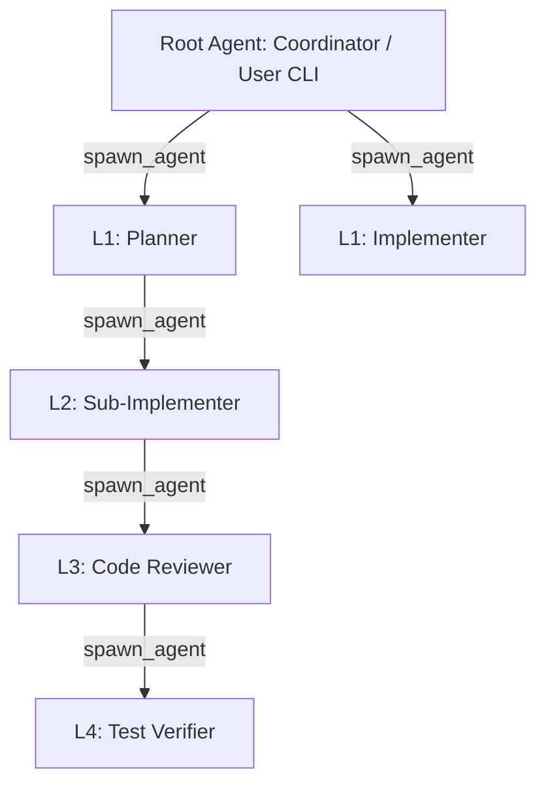
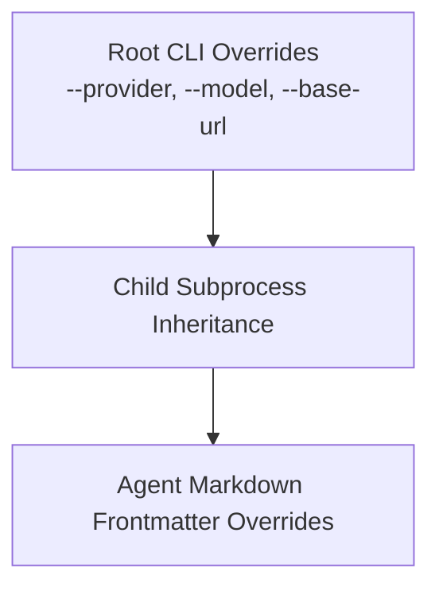

# Recursive Multi-Agent System (具名多智能体体系)

Metis provides a native, production-ready recursive multi-agent system designed for complex, deep software engineering and multi-step reasoning workflows. Unlike simple agent wrappers, Metis multi-agent coordination operates natively within the core engine, providing recursive task delegation, role-based tool sandboxing, physical workspace isolation, deterministic lifecycle control, and cascading configuration inheritance.

---

## 1. Core Architecture: Recursive Delegation Model

Metis implements an **L0 → L1 → L2 → L3 → L4** recursive delegation hierarchy:



Each spawned agent process receives a structured runtime context:
- `rootRunId`: Globally unique identifier across the entire invocation tree.
- `parentId`: Agent identifier of the direct parent.
- `agentId`: Unique identifier for the spawned child agent.
- `depth`: Integer representing recursion depth (`0` for root, `1` for L1, ..., `5` for L5).

---

## 2. Agent Definition & Discovery

Agents are defined as Markdown files with YAML frontmatter located in:
- **Project-level**: `.metis/agents/*.md` (highest precedence, scoped to repository)
- **User-level**: `~/.metis/agents/*.md` (global across all projects)
- **Built-in**: Stored in the Metis core runtime catalog.

### Frontmatter Schema (TypeBox Validated)

```markdown
---
name: backend-engineer
description: Expert in Node.js, TypeScript backend architecture and APIs
model: anthropic/claude-3-7-sonnet
thinking: high
tools:
  - read
  - write
  - edit
  - bash
  - spawn_agent
env:
  NODE_ENV: test
---

You are an expert backend engineer. When implementing APIs:
1. Write clean, modular TypeScript code.
2. Ensure strict type safety and error boundaries.
3. Validate inputs using standard schema libraries.
```

### Supported Configuration Fields

| Field | Type | Description |
| :--- | :--- | :--- |
| `name` | `string` (required) | Unique identifier for the agent (kebab-case recommended). |
| `description` | `string` (required) | Short description of role and specialization. |
| `model` | `string` (optional) | Model identifier to use (e.g. `openai/gpt-4o`, `anthropic/claude-3-7-sonnet`). |
| `thinking` | `string` (optional) | Thinking level (`off`, `minimal`, `low`, `medium`, `high`, `xhigh`). |
| `tools` | `string[]` (optional) | Tool allowlist. Only listed tools will be available. If omitted, defaults to parent toolset. |
| `env` | `Record<string, string>` (optional) | Custom environment variables injected into the agent runtime. |
| `systemPrompt` / Body | `string` (optional) | Role-specific prompt instructions (the Markdown body below frontmatter). |

---

## 3. Built-in Standard 5-Role Ecosystem

Metis provides 5 pre-configured roles out of the box:

```mermaid
graph LR
    Coordinator[Coordinator<br/>(L0 Orchestrator)] --> Planner[Planner<br/>(Architecture & Plan)]
    Coordinator --> Implementer[Implementer<br/>(Code Implementation)]
    Coordinator --> Reviewer[Reviewer<br/>(Diff & Quality Review)]
    Coordinator --> Verifier[Verifier<br/>(Testing & Validation)]
```

1. **`coordinator`**: Orchestrates high-level workflow, decomposes complex user requirements, and delegates tasks to subagents. Retains `spawn_agent`, `agent_management`, and inspection tools.
2. **`planner`**: Researches the codebase, designs modular implementation plans, and outlines architecture changes without directly modifying files.
3. **`implementer`**: Executes concrete coding changes, file creations, edits, and refactorings with write permissions.
4. **`reviewer`**: Read-only agent that inspects diffs, verifies adherence to specifications, and flags potential security or regression risks.
5. **`verifier`**: Runs test suites, typechecks, linters, and runtime validation scripts to confirm correctness.

---

## 4. Multi-Agent Tool Suite

### 1. `spawn_agent`
Spawns a child agent to perform a specific delegated task.

```json
{
  "agent": "implementer",
  "task": "Implement JWT authentication middleware in src/auth.ts",
  "mode": "sync",
  "worktree": "branch",
  "context": "Previous discussion: using RS256 with rotation support"
}
```

- `mode`:
  - `"sync"`: Blocks parent until child completes and returns the final structured result.
  - `"async"`: Runs child in the background; parent receives agent ID and monitors asynchronously.
- `worktree`:
  - `"inherit"`: Runs in current directory.
  - `"branch"`: Creates an isolated Git Worktree branch.
  - `"temp"`: Copies codebase into an isolated temporary directory.

### 2. `list_agents`
Lists active and past child agents, their statuses (`running`, `completed`, `failed`, `cancelled`), depth, and metrics.

### 3. `wait_agent`
Deterministically waits for one or more background (`async`) child agents to complete with timeout support.

### 4. `kill_agent`
Terminates a runaway child agent. If `cascade: true` (default), kills all descendant subprocesses within the process group (PGID).

### 5. `message_agent`
Sends a guidance or interrupt message to a running child agent.

---

## 5. Cascading Configuration & Inheritance Rules

Metis guarantees deterministic inheritance across recursively spawned child processes:



### Precedence Resolution:
1. **Agent Frontmatter Definition** (Highest priority for role-specific tool restrictions or explicit model bindings)
2. **Parent Runtime Context** (Transfers resolved Provider, Base URL, API Keys, OpenRouter Headers, explicit `--skill`, `--extension`)
3. **Global CLI / Config Defaults** (Default fallback)

### OpenRouter & Custom BaseURL Pass-Through:
- When the parent uses `--base-url <url>` or OpenRouter, child processes automatically inherit the base URL, attribution headers (`HTTP-Referer`, `X-Title`), and routing preferences.

---

## 6. Security, Isolation & Safety Controls

### 1. SpawnGuard Limits
Protects system resources against runaway recursion:
- `max_spawn_depth`: Maximum recursion depth (default: `5`, configurable via `--max-spawn-depth`).
- `max_children_per_agent`: Maximum children a single agent can spawn (default: `8`).
- `max_concurrent_agents`: Concurrency pool cap (default: `4`, configurable via `--max-concurrent`).

### 2. Spawn Loop Detection & Duplicate Task Challenge
When an agent attempts to spawn a duplicate or circular task (e.g. A → B → A with identical prompts), `SpawnGuard` intercepts the execution and raises a `DUPLICATE_TASK_WARNING`. The model must provide explicit `rationale` or pass `force: true` to bypass.

### 3. Orphan Process Prevention
The engine registers process-level exit and signal handlers (`SIGINT`, `SIGTERM`, `exit`). If the root or intermediate process terminates, all child process trees (PGID) are immediately and cleanly terminated.

### 4. Physical Worktree Isolation
When multiple agents edit files concurrently, `worktree: "auto"` or `worktree: "branch:<name>"` creates a Git Worktree from a snapshot of the parent workspace, including its uncommitted and untracked files. This prevents file locks and merge corruption without hiding code the parent is actively editing. Successful isolated workspaces are retained so the parent can inspect and integrate child changes; failed, cancelled, and timed-out workspaces are cleaned up automatically. Retained workspaces are removed during process shutdown if the parent has not integrated them earlier.

### 5. Sensitive Environment Variable Filtering
Child processes automatically strip dangerous injection environment variables (`LD_PRELOAD`, `DYLD_INSERT_LIBRARIES`, etc.), while preserving authentication keys safely.

### 6. Credential Redaction in Trace
All JSONL logs and trace outputs automatically mask sensitive API keys and authorization tokens.

