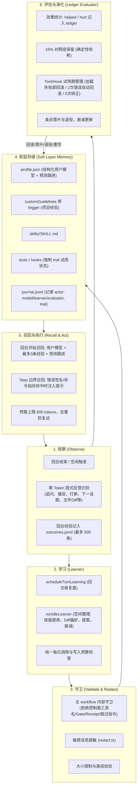

# 自主自我学习闭环 (Autonomous Self-Learning Architecture)

本文档定义 Metis 自主自我学习（Autonomous Self-Learning）闭环的架构设计、数据结构、安全边界、调用预算、UI 呈现与验证规范。

---

## 1. 核心设计原则

1. **在现有学习闭环上升级，不新建平行系统**
   - 现有的 `activation`、`store`、`journal`、`history`、`learner`、`ledger`、`effective`、`validate` / `redact`、`adapt` 工具、`/adaptations` 服务接口和 Desktop 自我学习设置页全部沿用。
   - 不新建平行的 memory 引擎、独立后台进程或替代模块。
2. **主 Workflow（Performance 状态机）绝对只读与不可侵犯**
   - reliable-headless 的 Performance 主流程（包括 admit、实现、独立核验、repair、T 分级、G0 到 G7 的 gate 和 receipt、`FALSE_COMPLETION_BLOCKED`、Controller、ChildResult、spawn 路由以及基础 system prompt）严禁修改。
   - 核心文件保持 0 修改：`performance-runtime.ts`、`performance-gate.ts`、`task-execution-controller.ts`、`reliable-headless-runners.ts`、`host-named-child-runner.ts`、`spawn_agent.ts`、`update-plan.ts`。
   - 学习层仅只读观察已发生的事件与终态快照。
   - 自主学习只写软层（用户模型、带触发条件的 guidelines、skills、处于试用期的 tool/hook/proposal），绝不自主写入 `workflow.extraChecks` 或 `routeBias`（这两项必须由用户显式 `adapt` 或人工写入）。
3. **零 Token 快速启发式过滤与统一预算控制**
   - 观察阶段通过零 Token 启发式判断是否有学习价值（包括用户沟通风格、语言与排版偏好均为零 Token 信号）。
   - 回合级复盘与空闲整理共用统一配额与写入路径。

---

## 2. 闭环架构流程



---

## 3. 数据结构规范

### 3.1 结构化用户模型 (`profile.json`)
由原来的 `profile.md` 自由文本升级为结构化数据，存储在 scope 根目录（`~/.metis/agent/adaptations/profile.json` 或项目目录）。兼容旧的 `profile.md`，首次写入时自动迁移。

```typescript
export interface UserTrait {
  dimension: "communication" | "rigor_and_acceptance" | "autonomy" | "coding_style" | "toolchain" | "domain_vocabulary";
  statement: string;
  confidence: number; // 0.0 - 1.0
  evidence: string[]; // 支撑事实或观察历史
  lastConfirmed: string; // ISO 日期
  status: "tentative" | "active" | "retired";
  userStated?: boolean; // 用户显式提出时为 true，不衰减且不进对照组
}

export interface FollowUpPrediction {
  triggerPattern: string; // 例如: "repair_after_bug", "feature_delivery"
  prediction: string;     // 例如: "交付前主动进行独立验收测试"
  supportCount: number;   // 支持次数 (达到 3 次以上时触发预测注入)
  confidence: number;
  lastTriggered?: string;
}

export interface UserProfileData {
  version: 2;
  traits: UserTrait[];
  followUpPredictions: FollowUpPrediction[];
  updatedAt: string;
}
```

### 3.2 带触发条件的架构准则 (`architecture.customGuidelines`)
在 `architecture.json` 中定义，支持纯字符串与带触发条件的对象：

```typescript
export interface GuidelineTrigger {
  command?: string;   // 命令指纹 (如 "npm test", "git commit")
  error?: string;     // 错误签名或关键字 (如 "ETIMEDOUT", "Cannot find module")
  intent?: string;    // 意图标签 (如 "refactor", "test", "build")
  keyword?: string;   // 提示词关键词
}

export interface CustomGuidelineItem {
  id?: string;
  text: string;
  trigger?: GuidelineTrigger;
}

export interface ArchitectureAdaptation {
  hiddenTools?: string[];
  customGuidelines?: (string | CustomGuidelineItem)[];
  preferredTools?: string[];
}
```

纯字符串准则每次回合都会注入。对象型 `customGuidelines` 校验时**强制要求至少存在一个触发条件**（`keyword`、`regex`、`intent`、`command`、`filePattern`、`error`、`errorPattern` 等），未配置任何触发条件的对象无法通过校验。召回时与用户提示词、当前执行命令或错误信息对齐；已退役（`status === "retired"`）的准则自动跳过召回。

写入合并与防覆盖机制：
- **Architecture 写入合并**：新写入的架构准则与现有 `customGuidelines` 增量合并，按 `text` 相同项就地更新，保留历史准则，对象缺少 `id` 时自动分配基于内容的确定性哈希 ID。
- **Profile 单一实例与特征合并**：优先使用 `profile.json`，存在 `profile.json` 时避免并存影子文件 `profile.md`。特征按 `statement` 增量合并与更新置信度，不覆盖已有其他维度的特征。
- **Skill 缩短与命令丢参拦截**：当模型尝试更新同名技能且新内容明显变短且丢失了原有关键命令标志/标记（如 `--lang`、`CMS_STAMP`、`nonce` 等）时，系统自动拒绝写入，在 `journal.jsonl` 中记录 `action: "reject"` 并抛出异常，防止旧的成功经验被坏摘要覆盖。
- **坏 JSON 不计入 applied**：模型输出无法解析为合规 JSON 时，退还调用配额，推进水印时间戳，且不增加 `appliedCount`。
- **统一 3 段式标识符**：统一使用 `adaptationId(scope, kind, name)`（如 `project:skill:publish`、`user:architecture:g1`、`project:tool:runner`）串联召回、账本统计与自动回滚。`listAdaptations` 自动聚合准则级数据。

学到的技能必须是带 `name` 和 `description` 的 `SKILL.md`。描述里要有用户自己的说法，回合开始时才会把正文注入。缺说明头的正文在写入时会被补上，否则技能目录加载会直接丢掉它。


### 3.3 回合经验记录 (`outcomes.jsonl`)
存储在项目 scope 下 `outcomes.jsonl`，按时间顺序追加，滚动最多保留 500 条：

```typescript
export interface TurnOutcomeRecord {
  id: string;
  turnIndex: number;
  sessionId: string;
  timestamp: string;
  intentTag?: string;
  commandFingerprints: Array<{ command: string; exitCode: number }>;
  recoveryPairs: Array<{ failedCommand: string; recoveredCommand: string }>;
  errorSignatures: string[];
  recalledAdaptationIds: string[];
  implicitFeedbackScore?: number; // -1.0 到 1.0
  performanceSnapshot?: {
    status?: string;
    frontier?: string;
    reportsCount: number;
  };
}
```

### 3.4 变更审计日志 (`journal.jsonl`) 扩展
每条变更记录增加执行者 `actor` 与试用状态 `trial`：

```typescript
export interface JournalEntry {
  id: string;
  timestamp: string;
  action: "apply" | "rollback" | "retire";
  scope: "user" | "project";
  kind: AdaptationKind;
  name?: string;
  revision: number;
  previousRevision?: number;
  reason?: string;
  snapshotId?: string;
  actor?: "model" | "learner" | "evaluator";
  trial?: boolean;
}
```

---

## 4. 边界守卫与安全性 (Boundary Guard)

在 `validate.ts` 中实现内容守卫 `assertMainWorkflowInvariance(content: string)`：
1. **控制面工具与 Gate 防篡改**
   - 拒绝出现控制面工具：`performance_admit`、`performance_gate`、`update_plan`、`read_plan`、`spawn_agent`、`ask_user`、`adapt`。
   - 拒绝出现 Gate 编号与 Receipt 机制：`G0`、`G1`、`G2`、`G3`、`G4`、`G5`、`G6`、`G7`、`verificationReceipt`、`receipt` 等。
2. **绕过与违规意图拦截**
   - 拒绝包含“跳过验证”、“绕过 gate”、“直接完成”、“无需测试”、“无需核验”、“bypass check”、“skip verification”等意图的文本。
3. **软层限定**
   - 自主复盘与整理只允许产出 profile、architecture (guidelines)、skill 以及试用期 tool/proposal。
   - 严禁自主生成或变更 `workflow.extraChecks` 与 `workflow.routeBias`。

---

## 5. 预算与调用配额 (Budgets & Quotas)

- `selfLearning.dailyCallBudget`: 每日模型调用上限，默认无限制（可按需显式配置具体上限）。
- `selfLearning.learnerModel`: 可选专用低成本模型。未配置时沿用会话主模型。
- 单次调用输入预算上限: 6000 tokens。无信号时不触发调用。
- 回合内召回预算上限: 600 tokens。

---

## 6. 评估、对照组与试用期 (Ledger Evaluator)

1. **效果归因 (helped / hurt)**
   - 回合内记录被召回的条目 ID。若回合顺利交付且获得正面隐式反馈，记为 `helped + 1`（且每回合仅记一次，避免重复统计）；若发生打断、撤回或错误归因，记为 `hurt + 1`。
   - **对照组不记录负向归因**：对照组（Holdout）回合仅作为反事实基线，即使工具报错也不计入 `hurt`，保护经验不被噪声误伤。
   - **退役不删文件**：架构准则或技能达到 2 次 `hurt` 时状态标记为 `retired`，物理文件保留在磁盘，召回阶段自动跳过，支持人工审查与重新激活。
2. **对照组机制 (Control Group)**
   - 处于 `tentative` 状态的条目，在 15% 的回合中不注入。
   - 是否为对照组回合采用确定性算法：`hash(sessionId + turnIndex) % 100 < 15`。
   - 用户明确提出的条目（`userStated: true`）直接进入 `active`，不进入对照组。
3. **Tool 与 Hook 试用期与自动回滚**
   - 新增 Tool / Hook 强制标记为 `trial: true`。
   - 加载阶段（`resource-loader.ts`）报错立即触发 `rollbackAdaptation`，journal 记录 `actor: "evaluator"`。
   - 运行阶段根据错误来源（`ExtensionRunner.onError` 或 `sourceInfo.source === "adaptation"`）进行错误归因。
   - 使用统一 3 段式 ID（`project:tool:<name>`）解析归因，错误达到 2 次自动回滚到上一安全版本。
   - 累计安全使用达到 5 次且无负面反馈，晋升为转正状态（`trial: false`）。

---

## 7. 用户界面与进度通知 (UI & Progress)

### 7.1 事件规范 (`learning_progress`)
```typescript
export interface LearningProgressEvent {
  type: "learning_progress";
  runId: string;
  trigger: "turn" | "idle";
  phase: "observe" | "review" | "guard" | "write" | "evaluate";
  step: number;
  total: number;
  status: "running" | "completed" | "skipped" | "failed";
  summary?: string;
}
```

### 7.2 客户端呈现
- **Desktop 界面**:
  - `useMetisServer.ts` 监听 `learning_progress` 事件。
  - `ChatHeader.tsx` 呈现优雅、不打扰的进度状态（文案按触发类型区分：回合复盘显示“正在学习 · 复盘本回合 {step}/{total}”，空闲整理显示“正在学习 · 整理经验 {step}/{total}”）。
  - 学习完成后短暂展示成果摘要（“学到 2 条：…”，几秒后淡出；点击直达“设置 - 自我学习”面板）。
  - 失败或跳过时仅显示低饱和度辅助提示，不打断流式响应，保持 Windows 标题栏间距。
- **Desktop 设置面板**:
  - 扩展显示用户特征与置信度。
  - 展示项目经验与触发条件。
  - 显示试用期状态、效果统计 (helped / hurt / recurred) 与成长趋势图表。
  - 保留并完善一键回滚。
- **TUI 界面**:
  - 底栏信息区同步显示最新学习状态文字。
