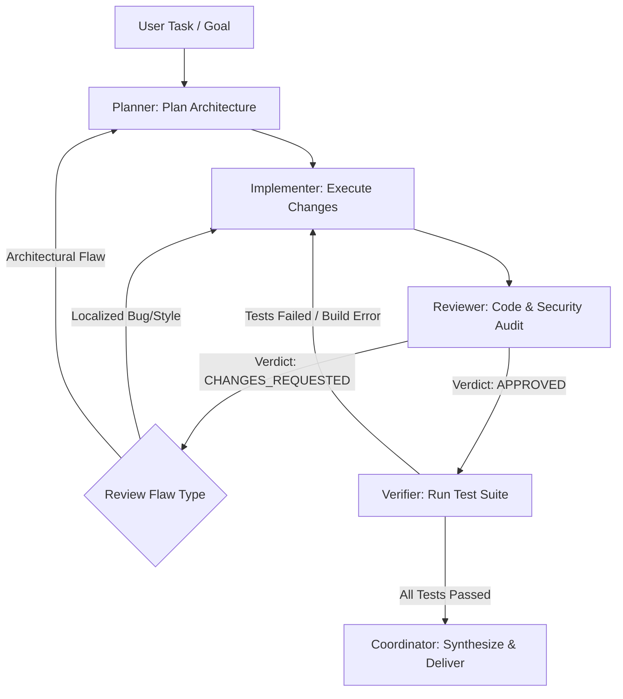

# Autoprompt: Multi-Agent Orchestration Procedure

The `autoprompt` skill provides autonomous coordination and task delegation procedures across Metis's 5 specialized built-in roles:

| Role | Responsibility | Allowed Tools | Mutation Access |
| :--- | :--- | :--- | :---: |
| **`coordinator`** | Task decomposition, workflow orchestration, subagent dispatch & synthesis. | `spawn_agent`, `read`, `grep`, `find`, `ls` | ❌ No direct mutation |
| **`planner`** | In-depth code inspection, dependency analysis, actionable phased planning. | `read`, `grep`, `find`, `ls` | ❌ Read-only |
| **`implementer`** | Code edits, file creation, shell commands, localized refactoring. | `read`, `write`, `edit`, `bash`, `grep`, `find`, `ls` | ✅ Full mutation |
| **`reviewer`** | Code review, diff inspection, architecture & security compliance. | `read`, `grep`, `find`, `ls` | ❌ Read-only |
| **`verifier`** | Automated testing, typechecking, build validation, acceptance verification. | `bash`, `read`, `grep`, `find`, `ls` | ✅ Execution only |

---

## 1. Adaptive Workflow Tiers (自适应编排模式)

Orchestrate tasks flexibly based on scope, risk, and complexity. Do not force simple tasks through rigid multi-stage pipelines:

### Tier A: Lightweight / Direct Mode (轻量直接模式)
- **Use when**: Fixing a simple bug, typo, running a diagnostic command, or making a self-contained single-file edit.
- **Flow**:
  1. Call `implementer` directly via `spawn_agent(agent="implementer", task=...)`.
  2. Verify changes locally or delegate quick test run to `verifier`.

### Tier B: Standard Feature / Bugfix Mode (标准特性开发与修复模式)
- **Use when**: Implementing a well-defined feature, multi-step bug fix, or updating tests and docs.
- **Flow**:
  1. **Plan**: Delegate to `planner` to inspect relevant code and create a concise plan.
  2. **Implement**: Delegate to `implementer` with the specific plan context.
  3. **Verify**: Delegate to `verifier` to run automated test suites and verify exit codes.

### Tier C: Full Quality & Security Pipeline (大型复杂重构与基准评测模式)
- **Use when**: Handling large multi-file refactoring, security-sensitive changes, or comprehensive benchmark challenges (e.g. TerminalBench / Harbor).
- **Flow**:
  1. **Goal Analysis & Scope Definition**: Clarify acceptance criteria, risks, and boundary conditions.
  2. **Planning (`planner`)**: Deep codebase exploration and phased architecture plan.
  3. **Implementation (`implementer`)**: Focused code modifications according to the plan.
  4. **Review (`reviewer`)**: Independent diff review for regressions, style violations, and logic flaws.
  5. **Verification (`verifier`)**: Automated test execution, build checks, and runtime verification.
  6. **Synthesis & Final Delivery**: Synthesize evidence and provide a structured final answer.

### Tier D: Read-Only Audit & Investigation Mode (只读审计与调研模式)
- **Use when**: Investigating architecture, answering complex technical questions, or auditing code quality without making modifications.
- **Flow**:
  - Dispatch `planner` for structural analysis or `reviewer` for diff/security audits.

### Tier E: Parallel Subagent Dispatch (并发委派模式)
- **Use when**: Multiple independent modules, components, or test files can be worked on concurrently without file lock conflicts.
- **Flow**:
  - Dispatch multiple agents with `mode: "async"` and `worktree: "auto"` (or separate worktrees).
  - Use `wait_agent` or `list_agents` to track status and synchronize completed results.

---

## 2. Dynamic Feedback Loops & Backtracking (反悔与阶段回退闭环机制)

Workflows are **not strictly one-way**. High-quality agent orchestration actively embraces iterative refinement and stage backtracking when downstream checks identify issues:



### A. Review Failure Backtracking (审查反悔与回退)
- When `reviewer` reports issues and issues `Verdict: CHANGES_REQUESTED`:
  - **Localized Fix**: Coordinator passes reviewer findings directly to `implementer` to patch bugs or style issues:
    ```typescript
    spawn_agent({
      agent: "implementer",
      task: "Fix issues identified by code review",
      context: reviewResult.result
    })
    ```
  - **Architectural Redesign**: If the reviewer points out a flawed foundational design, backtrack all the way to `planner` to revise the approach before editing more code.

### B. Verification Failure Backtracking (测试与构建失败回退)
- When `verifier` reports failing tests, typecheck errors, or broken builds:
  - Do **not** finalize or claim success.
  - Backtrack to `implementer` with the exact failing test names, stack traces, and error logs.
  - After `implementer` applies fixes, re-invoke `verifier` to prove that all tests pass.

### C. Planner & Implementer Self-Correction (规划与实现阶段动态反悔)
- If `implementer` discovers unforeseen blockers or edge cases during execution that invalidate the original plan, it should clearly state the blocker, allowing `coordinator` to loop back to `planner` for a revised strategy.

### D. Convergence Guardrails (收敛保护原则)
- Maintain a clear iteration limit (e.g. up to 3 fix-verify loop attempts per subtask).
- Always include accumulated error history in `context` so subagents do not oscillate or repeat the same failed attempt.

---

## 3. Using `spawn_agent` Effectively

### Synchronous vs Asynchronous Dispatch
```typescript
// Synchronous (blocking wait until subagent finishes):
spawn_agent({
  agent: "planner",
  task: "Inspect src/core/skills.ts and design built-in autoprompt skill loading.",
  mode: "sync"
})

// Asynchronous (background execution for parallel subtasks):
spawn_agent({
  agent: "implementer",
  task: "Implement test suite in test/autoprompt-skill.test.ts",
  mode: "async",
  worktree: "auto"
})
```

### Passing Context
Provide targeted, concrete background via the `context` parameter:
```typescript
spawn_agent({
  agent: "implementer",
  task: "Add BUILTIN_AUTOPROMPT_SKILL to src/core/skills.ts",
  context: "Plan approved: use src/core/builtins/skills/autoprompt/SKILL.md as base."
})
```

### Safeguards & Duplicate Task Handling
- Metis enforces a maximum spawn depth (default: 5) and concurrency pool limits.
- If a subagent call triggers a `DUPLICATE_TASK_WARNING` during a retry or loop-back, supply a clear `rationale` (e.g. `rationale: "Fixing review findings in attempt 2"`) or specify `force: true`.
- Subagents automatically discover project and user skills on-demand using `read`, preserving lean system prompts across all recursion depths.
